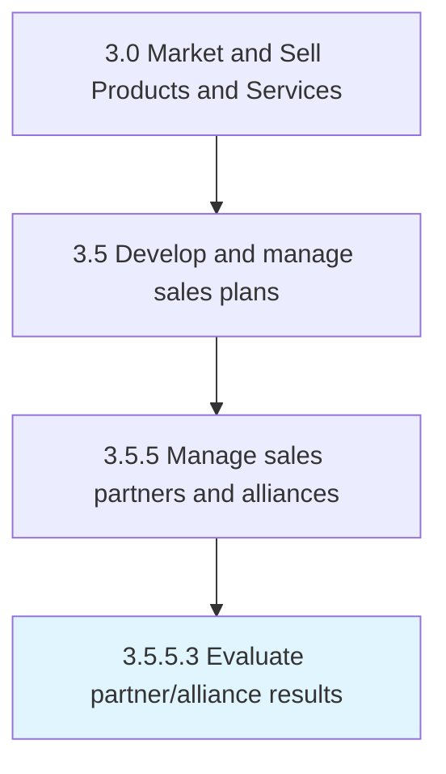

# Evaluate partner/alliance results

> Examining the performance of its partners/alliances in selling its products/services.

## Overview

Activity 3.5.5.3 is an activity within the Market and Sell Products and Services framework. 

Examining the performance of its partners/alliances in selling its products/services. Use metrics such as growth in revenue generated, conversion rate, and total outreach to customers for assessing the performance results.

## Process Hierarchy



## Key Statistics

| Metric | Value |
|--------|-------|
| APQC Code | 10214 |
| Hierarchy ID | 3.5.5.3 |
| Level | Activity |
| Parent | [3.5.5](../) |
| Sub-Processes | 0 |


## GraphDL Semantic Structure

```
evaluate.PartnerallianceResults
```

| Component | Value | Description |
|-----------|-------|-------------|
| Verb | `evaluate` | Primary action |
| Object | `partner/alliance results` | Direct object |


## Related Concepts

- [PartnerResults](/concepts/PartnerResults)
- [AllianceResults](/concepts/AllianceResults)


---

*Source: APQC PCF 10214 (3.5.5.3) - APQC*
