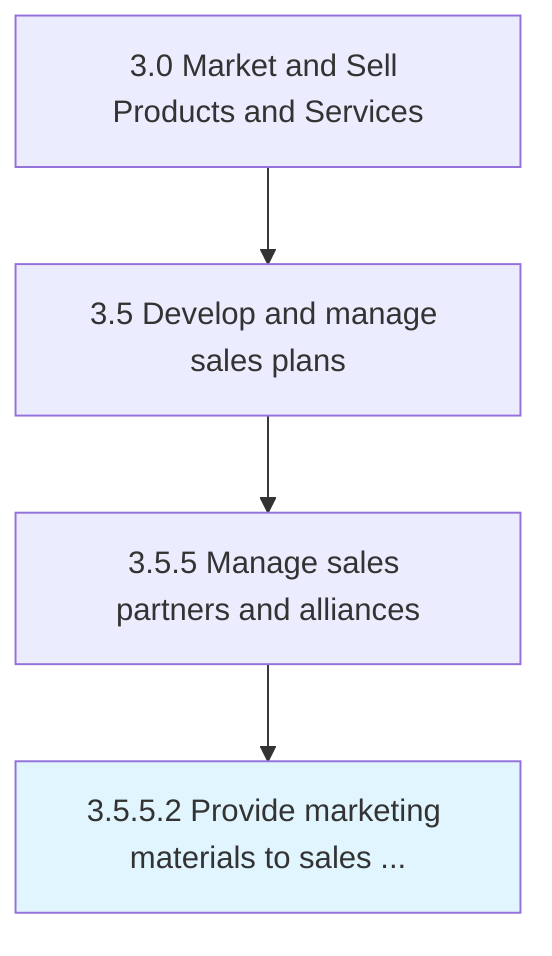

# Provide marketing materials to sales partners/alliances

> Distributing marketing materials and sales brochures to entities that the company partners with.

## Overview

Activity 3.5.5.2 is an activity within the Market and Sell Products and Services framework. 

Distributing marketing materials and sales brochures to entities that the company partners with.

## Process Hierarchy



## Key Statistics

| Metric | Value |
|--------|-------|
| APQC Code | 18641 |
| Hierarchy ID | 3.5.5.2 |
| Level | Activity |
| Parent | [3.5.5](../) |
| Sub-Processes | 0 |


## GraphDL Semantic Structure

```
provide.MarketingMaterials.to.SalesPartnersalliances
```

| Component | Value | Description |
|-----------|-------|-------------|
| Verb | `provide` | Primary action |
| Object | `marketing materials` | Direct object |
| Preposition | `to` | Relationship |
| PrepObject | `sales partners/alliances` | Indirect object |


## Related Concepts

- MarketingMaterials
- SalesPartners
- MarketingMaterials
- SalesAlliances


---

*Source: APQC PCF 18641 (3.5.5.2) - APQC*
