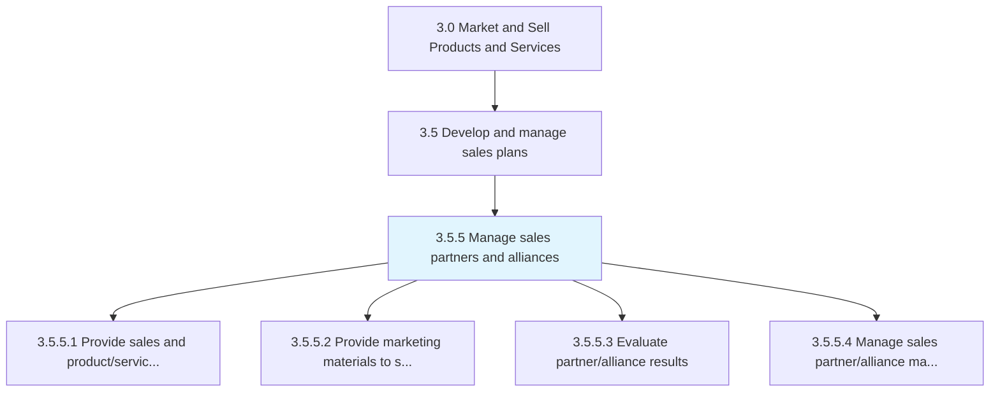
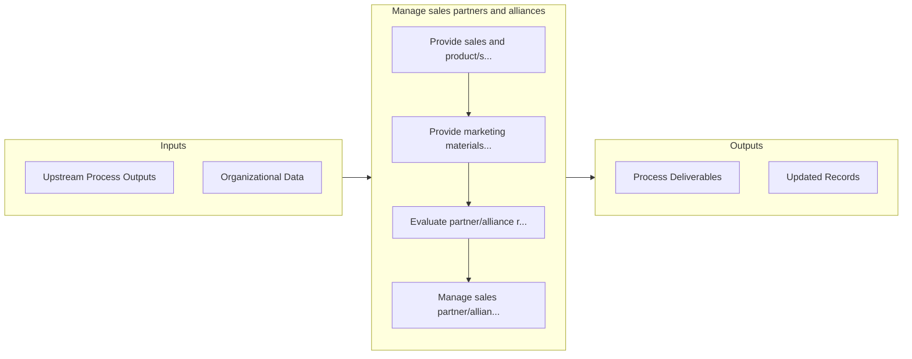

# Manage sales partners and alliances

> Managing the organization's partners and alliances, with the objective of maximizing revenue.

## Overview

Process 3.5.5 is a core process that defines the specific procedures for manage sales partners and alliances. 

Managing the organization's partners and alliances, with the objective of maximizing revenue. Train partners regarding the organization's portfolio of products/services. Craft sales forecasts. Examine their performance. Manage all data held by the organization on these partners.

## Process Hierarchy



## Key Statistics

| Metric | Value |
|--------|-------|
| APQC Code | 10187 |
| Hierarchy ID | 3.5.5 |
| Level | Process |
| Parent | [3.5](../) |
| Sub-Processes | 4 |


## GraphDL Semantic Structure

```
manage.SalesPartnersAndAlliances
```

| Component | Value | Description |
|-----------|-------|-------------|
| Verb | `manage` | Primary action |
| Object | `sales partners and alliances` | Direct object |


## Process Flow



## Sub-Processes

| Process | Hierarchy ID | Description |
|---------|-------------|-------------|
| [Provide sales and product/service training to sales partners/alliances](./3.5.5.1-ProvideSalesProductserviceTraining/) | 3.5.5.1 | Imparting guidance and instruction to sales partners/alliances concerning products/services |
| [Provide marketing materials to sales partners/alliances](./ProvideMarketingMaterialsToSalesPartnersalliances) | 3.5.5.2 | Distributing marketing materials and sales brochures to entities that the company partners with |
| [Evaluate partner/alliance results](./EvaluatePartnerallianceResults) | 3.5.5.3 | Examining the performance of its partners/alliances in selling its products/services |
| [Manage sales partner/alliance master data](./ManageSalesPartnerallianceMasterData) | 3.5.5.4 | Managing the repository of data relating to the organization's partners/alliances over time |


## Related Concepts

- [SalesPartners](/concepts/SalesPartners)
- [Alliances](/concepts/Alliances)


---

*Source: APQC PCF 10187 (3.5.5) - APQC*
