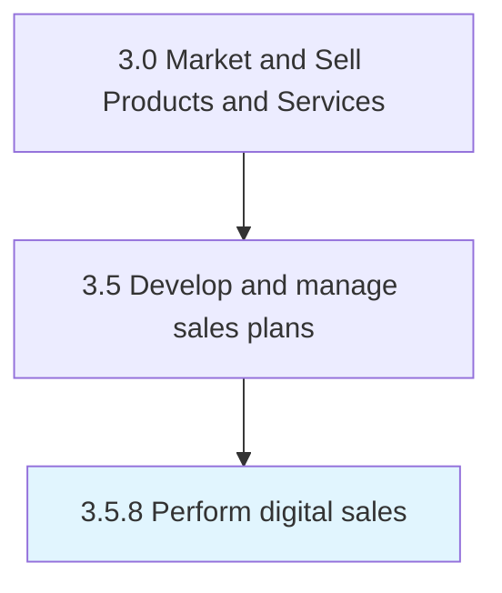

# Perform digital sales

> Execution of sales in an online environment.

## Overview

Process 3.5.8 is a core process that defines the specific procedures for perform digital sales. 

## Process Hierarchy



## Key Statistics

| Metric | Value |
|--------|-------|
| APQC Code | 21429 |
| Hierarchy ID | 3.5.8 |
| Level | Process |
| Parent | [3.5](../) |
| Sub-Processes | 0 |


## GraphDL Semantic Structure

```
perform.DigitalSales
```

| Component | Value | Description |
|-----------|-------|-------------|
| Verb | `perform` | Primary action |
| Object | `digital sales` | Direct object |


## Related Concepts

- [DigitalSales](/concepts/DigitalSales)


---

*Source: APQC PCF 21429 (3.5.8) - APQC*
