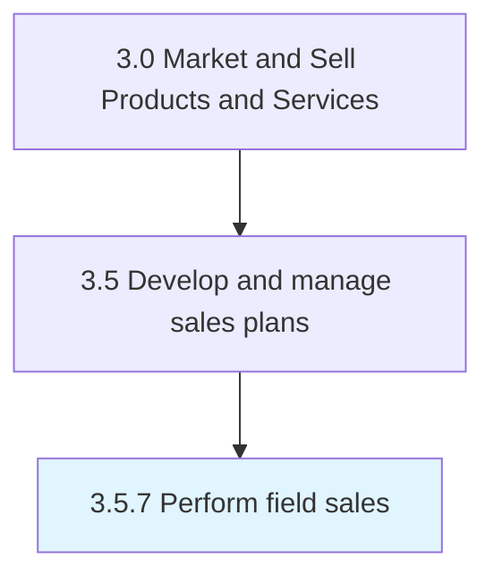

# Perform field sales

> Execution of sales within field/remote locations.

## Overview

Process 3.5.7 is a core process that defines the specific procedures for perform field sales. 

Execution of sales within field/remote locations. This could be any location that is not part of a headquarters location.

## Process Hierarchy



## Key Statistics

| Metric | Value |
|--------|-------|
| APQC Code | 21428 |
| Hierarchy ID | 3.5.7 |
| Level | Process |
| Parent | [3.5](../) |
| Sub-Processes | 0 |


## GraphDL Semantic Structure

```
perform.FieldSales
```

| Component | Value | Description |
|-----------|-------|-------------|
| Verb | `perform` | Primary action |
| Object | `field sales` | Direct object |


## Related Concepts

- [FieldSales](/concepts/FieldSales)


---

*Source: APQC PCF 21428 (3.5.7) - APQC*
