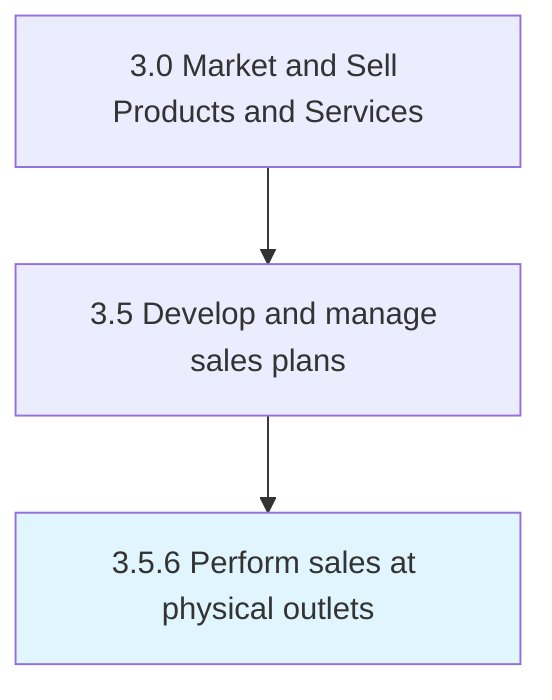

# Perform sales at physical outlets

> Execution of sales at physical / brick and mortar locations.

## Overview

Process 3.5.6 is a core process that defines the specific procedures for perform sales at physical outlets. 

Execution of sales at physical / brick and mortar locations.

## Process Hierarchy



## Key Statistics

| Metric | Value |
|--------|-------|
| APQC Code | 21427 |
| Hierarchy ID | 3.5.6 |
| Level | Process |
| Parent | [3.5](../) |
| Sub-Processes | 0 |


## GraphDL Semantic Structure

```
perform.SalesAtPhysicalOutlets
```

| Component | Value | Description |
|-----------|-------|-------------|
| Verb | `perform` | Primary action |
| Object | `sales at physical outlets` | Direct object |


## Related Concepts

- [Sales](/concepts/Sales)
- [PhysicalOutlets](/concepts/PhysicalOutlets)


---

*Source: APQC PCF 21427 (3.5.6) - APQC*
