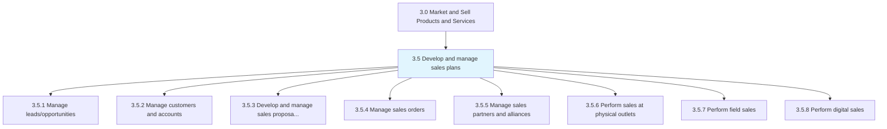
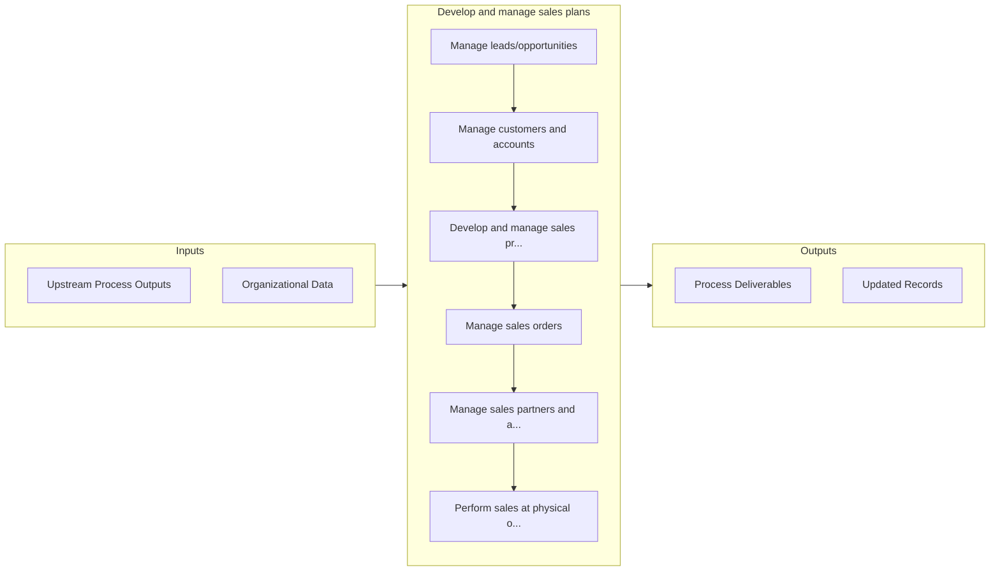

# Develop and manage sales plans

> Selling products/services.

## Overview

Group 3.5 is a process group within APQC Category 3.0 (Market and Sell Products and Services). 

Selling products/services. Set appropriate customer expectations. Work with customers using the same schedule that product/service development, production, and customer service functions follow. Manage sales personnel and sales partnerships/alliances.

## Process Hierarchy



## Key Statistics

| Metric | Value |
|--------|-------|
| APQC Code | 10105 |
| Hierarchy ID | 3.5 |
| Level | Group |
| Parent | [3](../) |
| Sub-Processes | 8 |


## GraphDL Semantic Structure

```
develop.AndManageSalesPlans
```

| Component | Value | Description |
|-----------|-------|-------------|
| Verb | `develop` | Primary action |
| Object | `and manage sales plans` | Direct object |


## Process Flow



## Sub-Processes

| Process | Hierarchy ID | Description |
|---------|-------------|-------------|
| [Manage leads/opportunities](./3.5.1-ManageLeadsopportunities/) | 3.5.1 | Generating leads of prospective customers to grow the organization's business |
| [Manage customers and accounts](./3.5.2-ManageCustomersAccounts/) | 3.5.2 | Managing the customer's expectations, with the intent of responsibly increasing the sale of the orga |
| [Develop and manage sales proposals, bids, and quotes](./3.5.3-DevelopManageSalesProposals/) | 3.5.3 | Understanding and refining the customer requirements as provided in a RFP (Request for Proposal) or  |
| [Manage sales orders](./3.5.4-ManageSalesOrders/) | 3.5.4 | Taking, receiving, processing, and acknowledging new customer orders or amendments to outstanding cu |
| [Manage sales partners and alliances](./3.5.5-ManageSalesPartnersAlliances/) | 3.5.5 | Managing the organization's partners and alliances, with the objective of maximizing revenue |
| [Perform sales at physical outlets](./PerformSalesAtPhysicalOutlets) | 3.5.6 | Execution of sales at physical / brick and mortar locations |
| [Perform field sales](./PerformFieldSales) | 3.5.7 | Execution of sales within field/remote locations |
| [Perform digital sales](./PerformDigitalSales) | 3.5.8 | Execution of sales in an online environment |


## Related Concepts

- SalesPlans
- SalesPlans


---

*Source: APQC PCF 10105 (3.5) - APQC*
