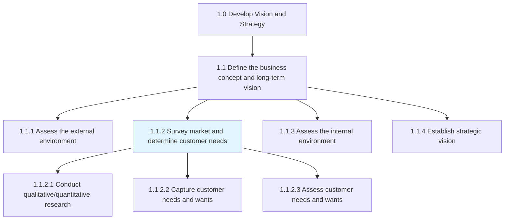
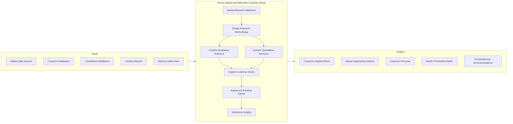
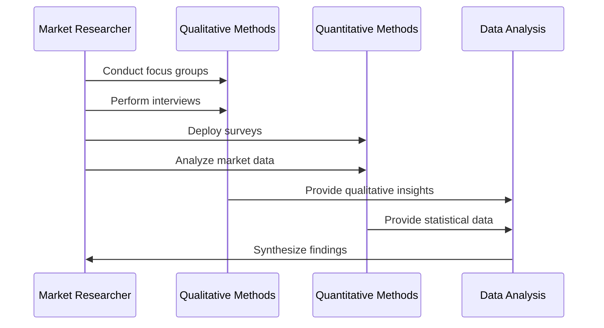
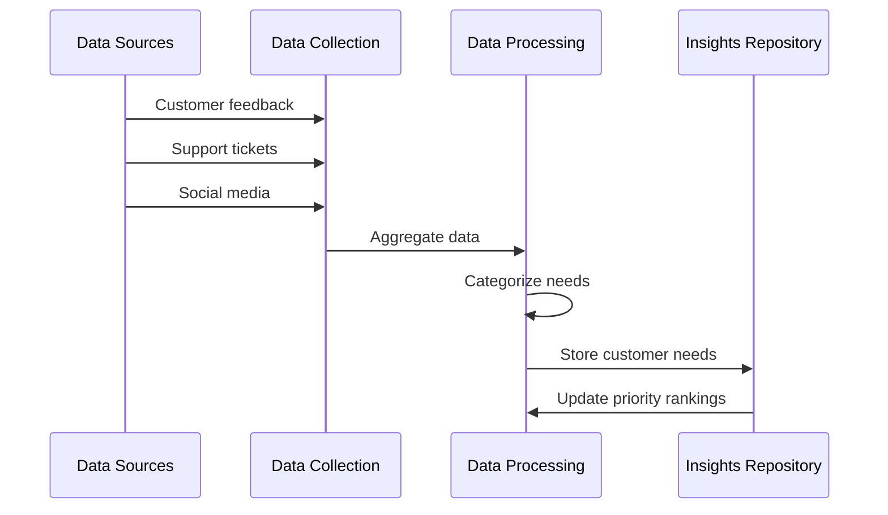
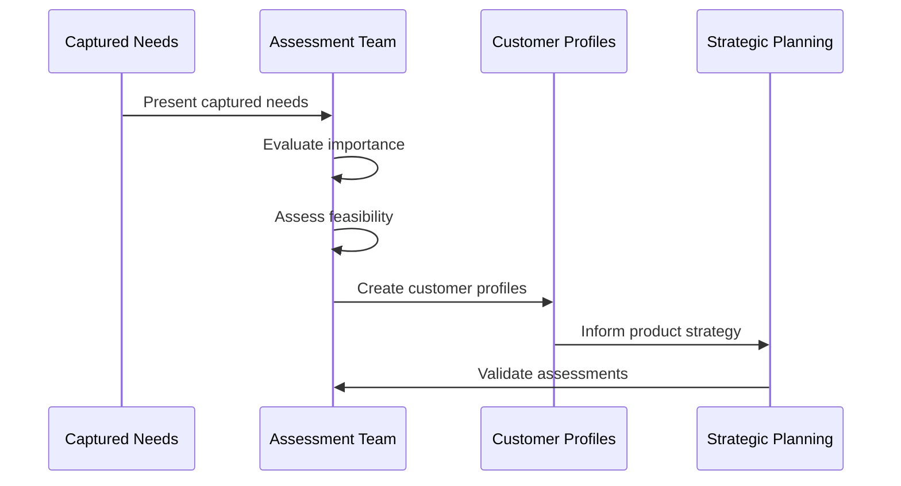
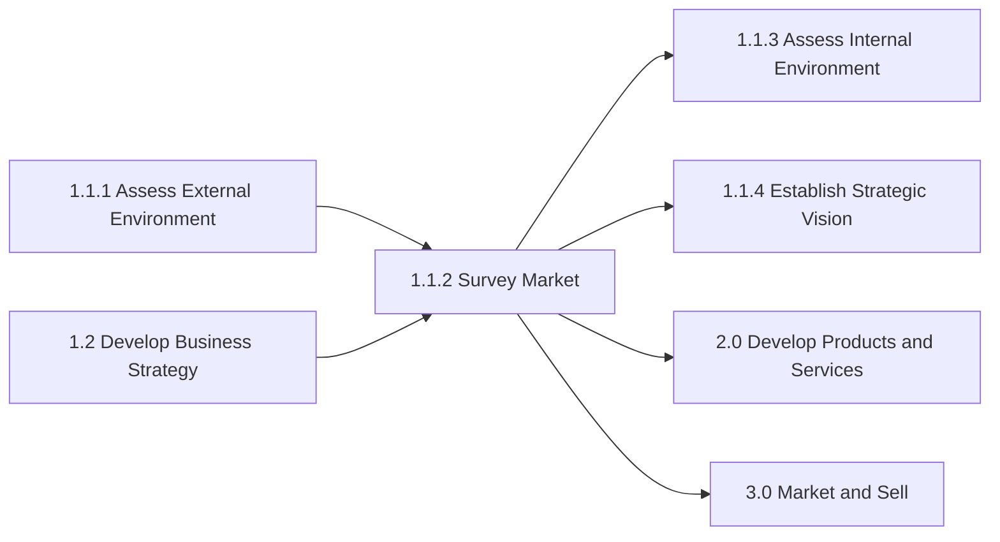

# Survey market and determine customer needs and wants

> Examining the market to identify customer required solutions. Assess the relevant market(s) to determine the products/services that are needed or wanted by customers. Carry out quantitative and qualitative analyses to capture and investigate products/services. Employ creative techniques that allow for a closer appreciation of the customer, and design relevant solutions.

## Overview

Survey market and determine customer needs and wants is a critical process within the Define Business Concept and Long-Term Vision process group (1.1). This process ensures that organizations understand their target markets and can identify gaps between current offerings and customer expectations. It forms the foundation for product development, marketing strategies, and overall business planning.

The process involves systematic collection and analysis of market data, customer feedback, and competitive intelligence to build a comprehensive picture of market opportunities. Organizations use both quantitative methods (surveys, analytics) and qualitative approaches (focus groups, interviews) to develop deep customer insights.

## Process Hierarchy



## Key Statistics

| Metric | Value |
|--------|-------|
| APQC Code | 10018 |
| Hierarchy ID | 1.1.2 |
| Level | Process |
| Parent Group | [Define business concept and long-term vision](/processes/01-Strategy/DefineTheBusinessConceptAndLongTermVision) |
| Category | [Develop Vision and Strategy](/processes/01-Strategy) |
| Child Activities | 3 |

## Process Flow



## GraphDL Semantic Structure

```
survey.Market.and.DetermineCustomerNeedsAndWants
```

| Component | Value | Description |
|-----------|-------|-------------|
| Verb | `survey` | Primary action of examining and researching |
| Object | `Market` | The target market being analyzed |
| Preposition | `and` | Conjunction linking related activities |
| PrepObject | `DetermineCustomerNeedsAndWants` | Secondary objective of identifying customer requirements |

## Activities

### 1.1.2.1 - Conduct qualitative/quantitative research and assessments

Investigating key market features and customer characteristics, using qualitative and quantitative measures to capture relevant aspects. Distill key ingredients that allow the organization to capture and assess customer needs and wants. Conduct standardized appraisals by defining selection parameters and setting quotas.



**Tasks:**
- `design.ResearchMethodology` - Create comprehensive research plan
- `conduct.FocusGroups` - Gather qualitative customer feedback
- `deploy.Surveys` - Collect quantitative market data
- `analyze.MarketData` - Examine statistical market information

### 1.1.2.2 - Capture customer needs and wants

Identifying and collecting customers' wants and needs of a product and/or services from a marketing perspective. Identify which consumer needs are important and whether needs are being met by current products/services.



**Tasks:**
- `gather.CustomerFeedback` - Collect direct customer input
- `analyze.SupportData` - Review customer service interactions
- `monitor.SocialMedia` - Track social sentiment and requests
- `categorize.CustomerNeeds` - Organize needs by type and priority

### 1.1.2.3 - Assess customer needs and wants

Creating customer profiles to get a picture of customers and their needs. Identify particular groups of people/organizations that benefit from your product/services and then selling to them.



**Tasks:**
- `evaluate.NeedsImportance` - Rank customer needs by priority
- `assess.Feasibility` - Determine viability of meeting needs
- `create.CustomerProfiles` - Develop detailed customer personas
- `validate.Assessments` - Confirm findings with stakeholders

## RACI Matrix

| Activity | Responsible | Accountable | Consulted | Informed |
|----------|-------------|-------------|-----------|----------|
| Define research objectives | Market Research Manager | CMO | Product, Sales | Strategy team |
| Design research methodology | Market Research Team | Market Research Manager | Analytics | Product team |
| Conduct qualitative research | Market Research Team | Market Research Manager | External agencies | Marketing |
| Conduct quantitative research | Analytics Team | Market Research Manager | IT | Marketing |
| Capture customer needs | Market Research Team | Product Manager | Customer Service | Sales |
| Assess and prioritize needs | Product Management | VP Product | Engineering | Executive team |
| Synthesize insights | Market Research Manager | CMO | Strategy | All stakeholders |

## Related Departments

- [Marketing](/departments/Marketing) - Primary ownership of market research activities
- [Product Management](/departments/Product) - Consumer of insights for product development
- [Sales](/departments/Sales) - Field intelligence and customer feedback
- [Customer Service](/departments/CustomerService) - Direct customer interaction data
- [Strategy](/departments/Strategy) - Strategic planning integration

## Related Occupations

- [Market Research Analysts](/occupations/MarketResearchAnalysts) - Primary execution of research
- [Marketing Managers](/occupations/MarketingManagers) - Research direction and strategy
- [Product Managers](/occupations/ProductManagers) - Insight application to products
- [Data Scientists](/occupations/DataScientists) - Advanced analytics support
- [Survey Researchers](/occupations/SurveyResearchers) - Quantitative research specialists

## Industry Variations

### Aerospace and Defense

Market research in aerospace focuses on long-term demand forecasting for aircraft fleets and defense systems. Customer needs analysis includes government contracting requirements and military specifications.

**Industry-Specific Activities:**
- Model customer fleets and aircraft demand
- Analyze defense budget projections
- Assess government procurement requirements
- Evaluate military specification compliance needs

### Consumer Products

Consumer products companies emphasize rapid consumer insight gathering through multiple channels. Focus on trend identification, brand perception, and purchase behavior analysis.

**Industry-Specific Activities:**
- Conduct consumer panel studies
- Analyze point-of-sale data
- Monitor social media trends
- Perform brand health tracking

### Healthcare Provider

Healthcare market research focuses on patient experience, clinical outcomes expectations, and healthcare service needs. Must comply with HIPAA and other privacy regulations.

**Industry-Specific Activities:**
- Assess patient experience needs
- Analyze clinical outcome expectations
- Evaluate healthcare access requirements
- Survey community health needs

### Retail

Retail market research emphasizes omnichannel customer behavior, shopping preferences, and price sensitivity analysis.

**Industry-Specific Activities:**
- Analyze shopping behavior patterns
- Assess channel preferences
- Evaluate price sensitivity
- Monitor competitive positioning

## Sub-Processes

| Process | Code | Description |
|---------|------|-------------|
| [Conduct qualitative/quantitative research](./ConductQualitativeQuantitativeResearch) | 1.1.2.1 | Investigating market features using mixed methods |
| [Capture customer needs and wants](./CaptureCustomerNeedsAndWants) | 1.1.2.2 | Identifying and collecting customer requirements |
| [Assess customer needs and wants](./AssessCustomerNeedsAndWants) | 1.1.2.3 | Creating profiles and prioritizing needs |

## Related Processes



## Metrics & KPIs

| Metric | Description | Target |
|--------|-------------|--------|
| Research Cycle Time | Time from research initiation to insights delivery | <4 weeks |
| Customer Coverage | Percentage of target segments researched | >90% |
| Insight Accuracy | Correlation of predictions to actual market behavior | >80% |
| Research ROI | Value generated from research-driven decisions | >5x investment |
| Customer Satisfaction | Alignment of products with identified needs | >85% CSAT |
| Market Share Growth | Growth attributed to market insight application | >2% annually |

---

*Source: APQC PCF 10018 (1.1.2) - Cross-Industry*
