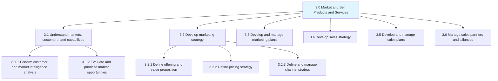

# Market And Sell Products and Services

> Outlining process groups related to understanding markets, customers, and capabilities; developing marketing strategies; executing marketing plans; developing sales strategies; developing and managing marketing plans; and managing sales partners and alliances.

## Overview

Market and Sell Products and Services is a core operating process category within the APQC Process Classification Framework. This category encompasses all activities related to understanding market dynamics, identifying customer needs, developing effective marketing and sales strategies, and executing plans to successfully commercialize products and services.

The processes in this category bridge the gap between product development and revenue generation, ensuring that organizations can effectively communicate value propositions, reach target audiences, and convert prospects into customers.

## Process Hierarchy

## Key Statistics

| Metric | Value |
|--------|-------|
| APQC Code | 10004 |
| Level | Category |
| Process Groups | 6 |
| Total Processes | 30+ |

## Process Groups

### 3.1 Understand markets, customers, and capabilities

Understanding the market landscape, customer segments, and organizational capabilities to inform strategic decisions.

| Process | Code | Description |
|---------|------|-------------|
| Perform customer and market intelligence analysis | 10096 | Gathering and analyzing market data |
| Evaluate and prioritize market opportunities | 10097 | Assessing opportunities for growth |

### 3.2 Develop marketing strategy

Creating comprehensive marketing strategies that define value propositions, pricing, and channel approaches.

| Process | Code | Description |
|---------|------|-------------|
| Define offering and value proposition | 10103 | Articulating product/service value |
| Define pricing strategy | 10107 | Setting pricing approaches |
| Define and manage channel strategy | 10113 | Determining distribution channels |

### 3.3 Develop and manage marketing plans

Executing marketing plans including campaigns, promotions, and brand management.

| Process | Code | Description |
|---------|------|-------------|
| Develop and manage advertising | 10120 | Creating advertising campaigns |
| Develop and manage promotions | 10129 | Managing promotional activities |
| Manage product packaging | 10147 | Packaging design and management |

### 3.4 Develop sales strategy

Defining sales approaches, methods, and coverage strategies.

| Process | Code | Description |
|---------|------|-------------|
| Develop sales forecast | 10165 | Projecting sales volumes |
| Develop sales partner/alliance strategy | 10166 | Partner channel strategies |

### 3.5 Develop and manage sales plans

Managing the sales lifecycle from lead generation through closing.

| Process | Code | Description |
|---------|------|-------------|
| Generate leads | 10171 | Creating sales opportunities |
| Manage customers and accounts | 10175 | Account management activities |
| Manage sales orders | 10181 | Order processing and fulfillment |

### 3.6 Manage sales partners and alliances

Managing partner relationships to maximize revenue through indirect channels.

| Process | Code | Description |
|---------|------|-------------|
| Manage partner training | 10188 | Training partners on products |
| Manage partner performance | 10190 | Tracking partner metrics |

## Related Processes in this Folder

These processes support the Market and Sell category through market analysis and performance evaluation:

- [Survey market and determine customer needs and wants](./MarketResearch.mdx) - Market research and customer needs analysis
- [Evaluate performance of existing products/services against market opportunities](./ProductPerformance.mdx) - Product performance assessment
- [Carry out post launch analytics to test the acceptability in the market](./PostLaunchAnalytics.mdx) - Post-launch market acceptance testing
- [Review market performance](./MarketPerformance.mdx) - Market performance tracking and review
- [Test market for new or revised products and services](./MarketTesting.mdx) - Market testing for new offerings

## Related Departments

- [Marketing](/departments/Marketing/index) - Primary ownership of marketing processes
- [Sales](/departments/Sales/index) - Sales strategy and execution
- Business Development - Market expansion and partnerships
- [Product Management](/departments/Product) - Product-market alignment

## Related Occupations

- [Marketing Managers](/occupations/Management/MarketingManagers) - Marketing strategy leadership
- [Sales Managers](/occupations/Management/SalesManagers) - Sales team leadership
- [Market Research Analysts](/occupations/MarketResearchAnalysts) - Market intelligence
- [Advertising Managers](/occupations/Management/AdvertisingManagers) - Campaign management
- [Public Relations Specialists](/occupations/ArtsMedia/PublicRelationsSpecialists) - Brand communications

## Industry Variations

### Consumer Products

Heavy emphasis on brand marketing, retail channel management, and consumer insights. Includes trade marketing and shopper marketing activities.

### Banking

Focus on product marketing for financial services, compliance-aware advertising, and relationship management across consumer and commercial segments.

### Retail

Emphasis on omnichannel marketing, promotional calendars, and store-level execution. Includes loyalty program management.

### Healthcare Provider

Patient acquisition marketing, physician relationship management, and community health outreach within regulatory constraints.

## Metrics & KPIs

| Metric | Description | Target |
|--------|-------------|--------|
| Customer Acquisition Cost | Cost to acquire a new customer | Industry benchmark |
| Customer Lifetime Value | Total revenue from a customer | >3x CAC |
| Marketing ROI | Return on marketing investment | >200% |
| Sales Conversion Rate | Percentage of leads converted | >20% |
| Market Share | Percentage of total market | Growth YoY |
| Brand Awareness | Percentage of target market aware | >70% |

---

*Source: APQC PCF 10004 (3.0) - Cross-Industry*
