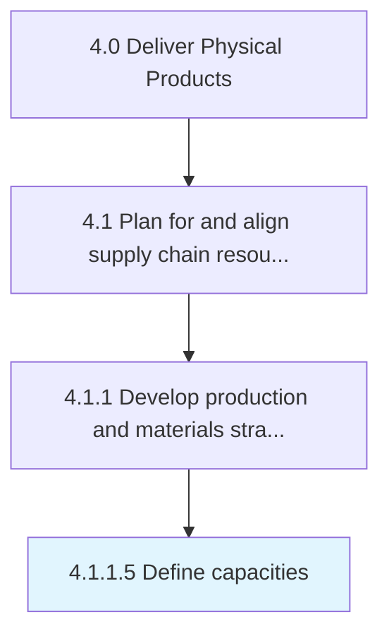

# Define capacities

> Outlining the manufacturing and processing capacities of the organization.

## Overview

Activity 4.1.1.5 is an activity within the Deliver Physical Products framework. 

Outlining the manufacturing and processing capacities of the organization. Delineate the capabilities required for optimizing output with available resources. Analyze capabilities possessed by the organization concerning the raw materials required and the process necessitated for producing finished products.

## Process Hierarchy



## Key Statistics

| Metric | Value |
|--------|-------|
| APQC Code | 10233 |
| Hierarchy ID | 4.1.1.5 |
| Level | Activity |
| Parent | [4.1.1](../) |
| Sub-Processes | 0 |


## GraphDL Semantic Structure

```
define.Capacities
```

| Component | Value | Description |
|-----------|-------|-------------|
| Verb | `define` | Primary action |
| Object | `capacities` | Direct object |


## Related Concepts

- Capacities


---

*Source: APQC PCF 10233 (4.1.1.5) - APQC*
