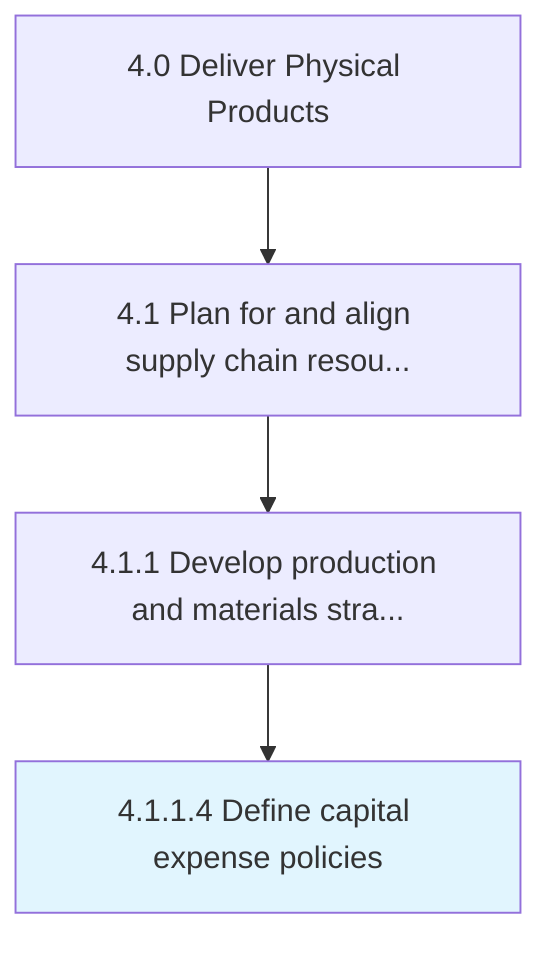

# Define capital expense policies

> Designing rules and regulations pertaining to the expenditure incurred in acquiring or upgrading the existing stock of manufacturing capital.

## Overview

Activity 4.1.1.4 is an activity within the Deliver Physical Products framework. 

Designing rules and regulations pertaining to the expenditure incurred in acquiring or upgrading the existing stock of manufacturing capital.

## Process Hierarchy



## Key Statistics

| Metric | Value |
|--------|-------|
| APQC Code | 10232 |
| Hierarchy ID | 4.1.1.4 |
| Level | Activity |
| Parent | [4.1.1](../) |
| Sub-Processes | 0 |


## GraphDL Semantic Structure

```
define.CapitalExpensePolicies
```

| Component | Value | Description |
|-----------|-------|-------------|
| Verb | `define` | Primary action |
| Object | `capital expense policies` | Direct object |


## Related Concepts

- CapitalExpensePolicies


---

*Source: APQC PCF 10232 (4.1.1.4) - APQC*
