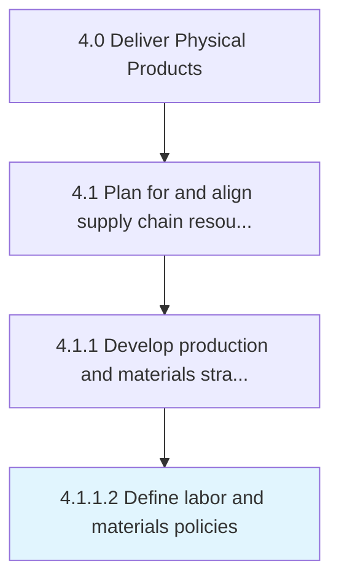

# Define labor and materials policies

> Setting up internal rules and regulations regarding the employees and the materials.

## Overview

Activity 4.1.1.2 is an activity within the Deliver Physical Products framework. 

Setting up internal rules and regulations regarding the employees and the materials.

## Process Hierarchy



## Key Statistics

| Metric | Value |
|--------|-------|
| APQC Code | 10230 |
| Hierarchy ID | 4.1.1.2 |
| Level | Activity |
| Parent | [4.1.1](../) |
| Sub-Processes | 0 |


## GraphDL Semantic Structure

```
define.LaborAndMaterialsPolicies
```

| Component | Value | Description |
|-----------|-------|-------------|
| Verb | `define` | Primary action |
| Object | `labor and materials policies` | Direct object |


## Related Concepts

- LaborPolicies
- MaterialsPolicies


---

*Source: APQC PCF 10230 (4.1.1.2) - APQC*
