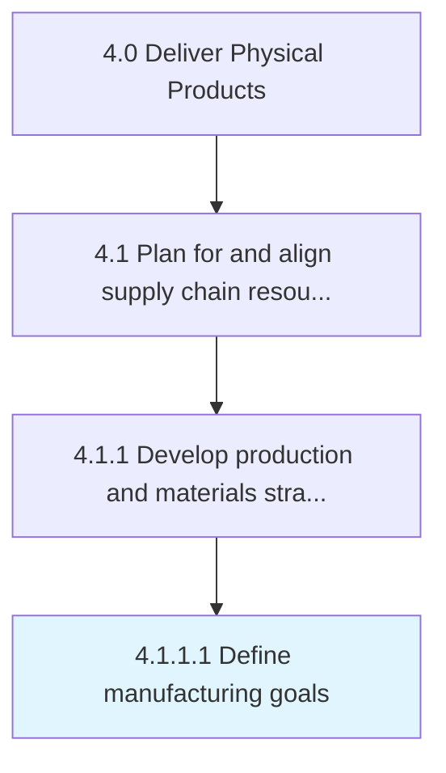

# Define manufacturing goals

> Creating quantifiable strategic objectives for each manufacturing segment in conjunction with sales projections.

## Overview

Activity 4.1.1.1 is an activity within the Deliver Physical Products framework. 

Creating quantifiable strategic objectives for each manufacturing segment in conjunction with sales projections.

## Process Hierarchy



## Key Statistics

| Metric | Value |
|--------|-------|
| APQC Code | 10229 |
| Hierarchy ID | 4.1.1.1 |
| Level | Activity |
| Parent | [4.1.1](../) |
| Sub-Processes | 0 |


## GraphDL Semantic Structure

```
define.ManufacturingGoals
```

| Component | Value | Description |
|-----------|-------|-------------|
| Verb | `define` | Primary action |
| Object | `manufacturing goals` | Direct object |


## Related Concepts

- [ManufacturingGoals](/concepts/ManufacturingGoals)


---

*Source: APQC PCF 10229 (4.1.1.1) - APQC*
