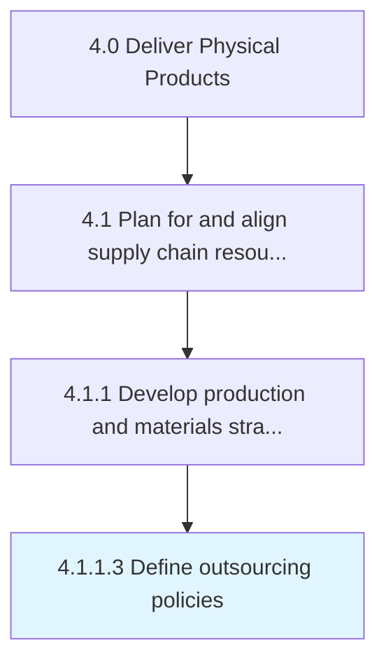

# Define outsourcing policies

> Creating rules and regulations regarding contracting out of a business process to another party in order to reduce costs.

## Overview

Activity 4.1.1.3 is an activity within the Deliver Physical Products framework. 

Creating rules and regulations regarding contracting out of a business process to another party in order to reduce costs.

## Process Hierarchy



## Key Statistics

| Metric | Value |
|--------|-------|
| APQC Code | 10231 |
| Hierarchy ID | 4.1.1.3 |
| Level | Activity |
| Parent | [4.1.1](../) |
| Sub-Processes | 0 |


## GraphDL Semantic Structure

```
define.OutsourcingPolicies
```

| Component | Value | Description |
|-----------|-------|-------------|
| Verb | `define` | Primary action |
| Object | `outsourcing policies` | Direct object |


## Related Concepts

- [OutsourcingPolicies](/concepts/OutsourcingPolicies)


---

*Source: APQC PCF 10231 (4.1.1.3) - APQC*
