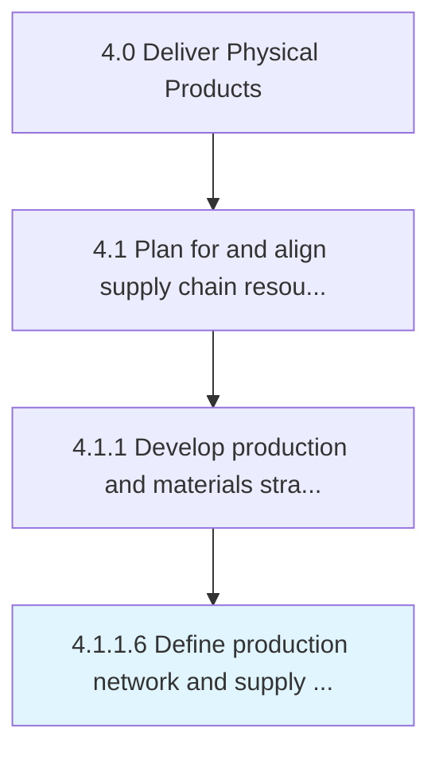

# Define production network and supply constraints

> Defining limitations in the ability of the organization's supply chain to deliver a new stock, and creating a network of production stakeholders.

## Overview

Activity 4.1.1.6 is an activity within the Deliver Physical Products framework. 

Defining limitations in the ability of the organization's supply chain to deliver a new stock, and creating a network of production stakeholders. Frame and manage relationships within the flow of manufacturing and processing operations. Identify probable supply issues.

## Process Hierarchy



## Key Statistics

| Metric | Value |
|--------|-------|
| APQC Code | 10234 |
| Hierarchy ID | 4.1.1.6 |
| Level | Activity |
| Parent | [4.1.1](../) |
| Sub-Processes | 0 |


## GraphDL Semantic Structure

```
define.ProductionNetworkAndSupplyConstraints
```

| Component | Value | Description |
|-----------|-------|-------------|
| Verb | `define` | Primary action |
| Object | `production network and supply constraints` | Direct object |


## Related Concepts

- ProductionNetwork
- SupplyConstraints


---

*Source: APQC PCF 10234 (4.1.1.6) - APQC*
