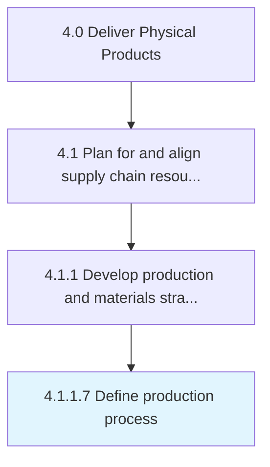

# Define production process

> Outlining the scheme of processing inventory into finished products/services.

## Overview

Activity 4.1.1.7 is an activity within the Deliver Physical Products framework. 

Outlining the scheme of processing inventory into finished products/services. This includes the use of raw materials, machinery, skill sets, and knowledge to create new offerings.

## Process Hierarchy



## Key Statistics

| Metric | Value |
|--------|-------|
| APQC Code | 14193 |
| Hierarchy ID | 4.1.1.7 |
| Level | Activity |
| Parent | [4.1.1](../) |
| Sub-Processes | 0 |


## GraphDL Semantic Structure

```
define.ProductionProcess
```

| Component | Value | Description |
|-----------|-------|-------------|
| Verb | `define` | Primary action |
| Object | `production process` | Direct object |


## Related Concepts

- ProductionProcess


---

*Source: APQC PCF 14193 (4.1.1.7) - APQC*
