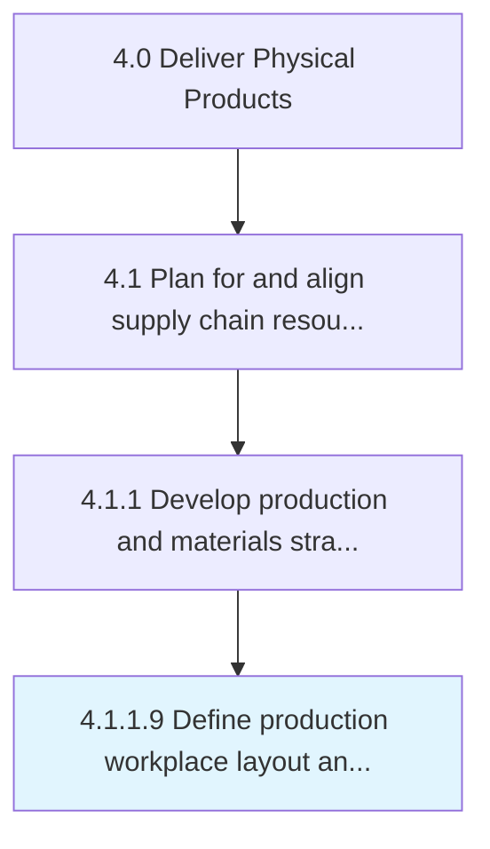

# Define production workplace layout and infrastructure

> Determining the floor plans for the processing facility that is meant for delivering finished products/services.

## Overview

Activity 4.1.1.9 is an activity within the Deliver Physical Products framework. 

Determining the floor plans for the processing facility that is meant for delivering finished products/services. Identify the totality of infrastructure needed for using this space in the manufacturing process, including machinery, factory floors, offices, and furniture.

## Process Hierarchy



## Key Statistics

| Metric | Value |
|--------|-------|
| APQC Code | 14194 |
| Hierarchy ID | 4.1.1.9 |
| Level | Activity |
| Parent | [4.1.1](../) |
| Sub-Processes | 0 |


## GraphDL Semantic Structure

```
define.ProductionWorkplaceLayoutAndInfrastructure
```

| Component | Value | Description |
|-----------|-------|-------------|
| Verb | `define` | Primary action |
| Object | `production workplace layout and infrastructure` | Direct object |


## Related Concepts

- [ProductionWorkplaceLayout](/concepts/ProductionWorkplaceLayout)
- [Infrastructure](/concepts/Infrastructure)


---

*Source: APQC PCF 14194 (4.1.1.9) - APQC*
