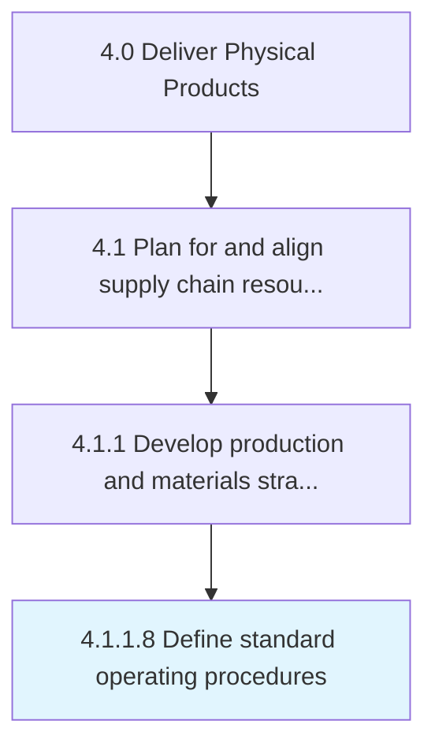

# Define standard operating procedures

> Establishing or prescribing methods to be followed routinely for the performance of designated operations or in designated situations.

## Overview

Activity 4.1.1.8 is an activity within the Deliver Physical Products framework. 

Establishing or prescribing methods to be followed routinely for the performance of designated operations or in designated situations. This may include step-by-step instructions to help workers carry out complex routine operations. The goal is to improve efficiency, quality, and uniformity of performance, while reducing miscommunication, failure, or rework.

## Process Hierarchy



## Key Statistics

| Metric | Value |
|--------|-------|
| APQC Code | 19551 |
| Hierarchy ID | 4.1.1.8 |
| Level | Activity |
| Parent | [4.1.1](../) |
| Sub-Processes | 0 |


## GraphDL Semantic Structure

```
define.StandardOperatingProcedures
```

| Component | Value | Description |
|-----------|-------|-------------|
| Verb | `define` | Primary action |
| Object | `standard operating procedures` | Direct object |


## Related Concepts

- [StandardOperatingProcedures](/concepts/StandardOperatingProcedures)


---

*Source: APQC PCF 19551 (4.1.1.8) - APQC*
