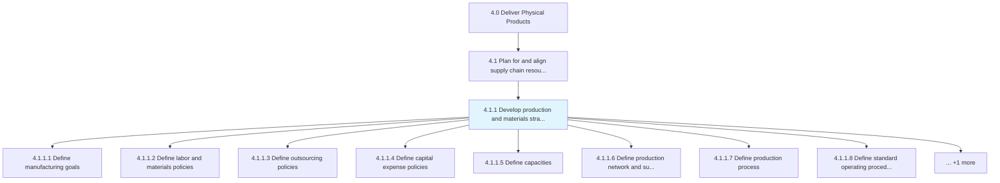
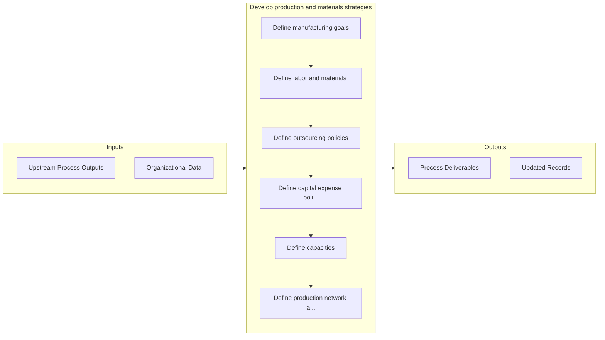

# Develop production and materials strategies

> Creating strategies for production processes, as well as the process of managing materials.

## Overview

Process 4.1.1 is a core process that defines the specific procedures for develop production and materials strategies. 

Creating strategies for production processes, as well as the process of managing materials. Define production and supply constraints. Design a blueprint of the workplace. Establish rules and regulations regarding the employees, outsourcing of services, and the expenditure to be incurred on the manufacturing capital.

## Process Hierarchy



## Key Statistics

| Metric | Value |
|--------|-------|
| APQC Code | 10221 |
| Hierarchy ID | 4.1.1 |
| Level | Process |
| Parent | [4.1](../) |
| Sub-Processes | 9 |


## GraphDL Semantic Structure

```graphdl
develop.ProductionAndMaterialsStrategies
```

| Component | Value | Description |
|-----------|-------|-------------|
| Verb | `develop` | Primary action |
| Object | `production and materials strategies` | Direct object |


## Process Flow



## Sub-Processes

| Process | Hierarchy ID | Description |
|---------|-------------|-------------|
| [Define manufacturing goals](./DefineManufacturingGoals) | 4.1.1.1 | Creating quantifiable strategic objectives for each manufacturing segment in conjunction with sales  |
| [Define labor and materials policies](./DefineLaborAndMaterialsPolicies) | 4.1.1.2 | Setting up internal rules and regulations regarding the employees and the materials |
| [Define outsourcing policies](./DefineOutsourcingPolicies) | 4.1.1.3 | Creating rules and regulations regarding contracting out of a business process to another party in o |
| [Define capital expense policies](./DefineCapitalExpensePolicies) | 4.1.1.4 | Designing rules and regulations pertaining to the expenditure incurred in acquiring or upgrading the |
| [Define capacities](./DefineCapacities) | 4.1.1.5 | Outlining the manufacturing and processing capacities of the organization |
| [Define production network and supply constraints](./DefineProductionNetworkAndSupplyConstraints) | 4.1.1.6 | Defining limitations in the ability of the organization's supply chain to deliver a new stock, and c |
| [Define production process](./DefineProductionProcess) | 4.1.1.7 | Outlining the scheme of processing inventory into finished products/services |
| [Define standard operating procedures](./DefineStandardOperatingProcedures) | 4.1.1.8 | Establishing or prescribing methods to be followed routinely for the performance of designated opera |
| [Define production workplace layout and infrastructure](./DefineProductionWorkplaceLayoutAndInfrastructure) | 4.1.1.9 | Determining the floor plans for the processing facility that is meant for delivering finished produc |


## Related Concepts

- ProductionStrategies
- MaterialsStrategies


---

*Source: APQC PCF 10221 (4.1.1) - APQC*
