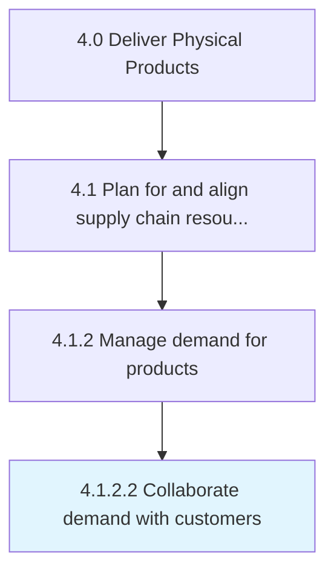

# Collaborate demand with customers

> Working closely with the organization's customers to understand their drives and behavior, with the objective of estimating future demand.

## Overview

Activity 4.1.2.2 is an activity within the Deliver Physical Products framework. 

Working closely with the organization's customers to understand their drives and behavior, with the objective of estimating future demand. Reach out to customers through various means to understand their behavior patterns, usage elasticity, and degree of variability--and ultimately determine demand for each offering.

## Process Hierarchy



## Key Statistics

| Metric | Value |
|--------|-------|
| APQC Code | 10236 |
| Hierarchy ID | 4.1.2.2 |
| Level | Activity |
| Parent | [4.1.2](../) |
| Sub-Processes | 0 |


## GraphDL Semantic Structure

```
collaborate.Demand.with.Customers
```

| Component | Value | Description |
|-----------|-------|-------------|
| Verb | `collaborate` | Primary action |
| Object | `demand` | Direct object |
| Preposition | `with` | Relationship |
| PrepObject | `customers` | Indirect object |


## Related Concepts

- Demand
- Customers


---

*Source: APQC PCF 10236 (4.1.2.2) - APQC*
