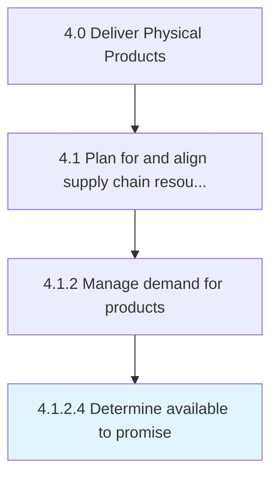

# Determine available to promise

> Identify the volume of products/services that may be committed for delivery to fulfill sales.

## Overview

Activity 4.1.2.4 is an activity within the Deliver Physical Products framework. 

Identify the volume of products/services that may be committed for delivery to fulfill sales. Figure out the amount of stock available. Forecast its volumes.

## Process Hierarchy



## Key Statistics

| Metric | Value |
|--------|-------|
| APQC Code | 10238 |
| Hierarchy ID | 4.1.2.4 |
| Level | Activity |
| Parent | [4.1.2](../) |
| Sub-Processes | 0 |


## GraphDL Semantic Structure

```
determine.Available.to.Promise
```

| Component | Value | Description |
|-----------|-------|-------------|
| Verb | `determine` | Primary action |
| Object | `available` | Direct object |
| Preposition | `to` | Relationship |
| PrepObject | `promise` | Indirect object |


## Related Concepts

- Available
- Promise


---

*Source: APQC PCF 10238 (4.1.2.4) - APQC*
