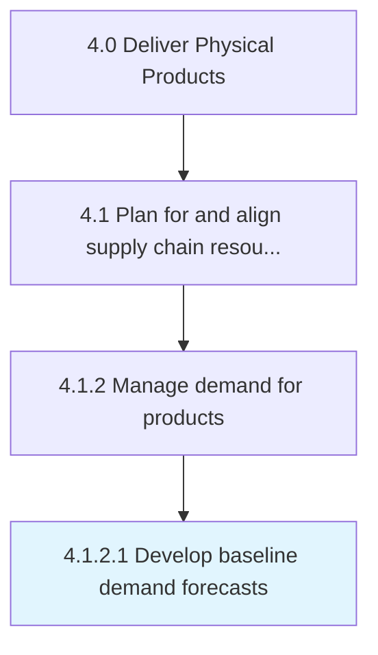

# Develop baseline demand forecasts

> Identify the bedrock levels of market demand anticipated for the organization's products/services.

## Overview

Activity 4.1.2.1 is an activity within the Deliver Physical Products framework. 

Identify the bedrock levels of market demand anticipated for the organization's products/services. Estimate future demand for product and services using historical data, analysis of the market environment and any externalities, etc. to create ex ante approximations.

## Process Hierarchy



## Key Statistics

| Metric | Value |
|--------|-------|
| APQC Code | 10235 |
| Hierarchy ID | 4.1.2.1 |
| Level | Activity |
| Parent | [4.1.2](../) |
| Sub-Processes | 0 |


## GraphDL Semantic Structure

```
develop.BaselineDemandForecasts
```

| Component | Value | Description |
|-----------|-------|-------------|
| Verb | `develop` | Primary action |
| Object | `baseline demand forecasts` | Direct object |


## Related Concepts

- [BaselineDemandForecasts](/concepts/BaselineDemandForecasts)


---

*Source: APQC PCF 10235 (4.1.2.1) - APQC*
