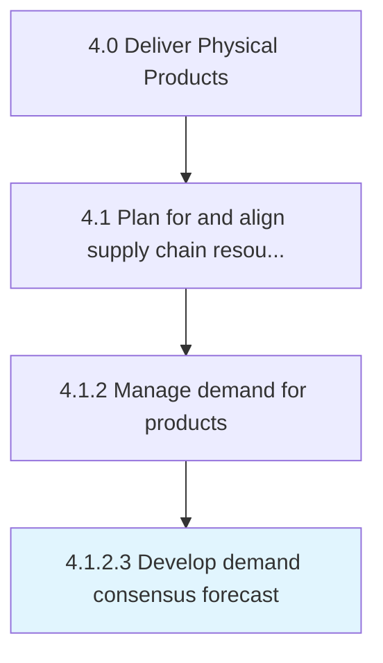

# Develop demand consensus forecast

> Arriving at a consensus over the forecasted levels of demand for products/services.

## Overview

Activity 4.1.2.3 is an activity within the Deliver Physical Products framework. 

Arriving at a consensus over the forecasted levels of demand for products/services. Consensus is achieved by juxtaposing decisions developed in the baseline forecast with those reached at by collaborating with customers. Enlist senior-level decision makers of the sales and marketing functions.

## Process Hierarchy



## Key Statistics

| Metric | Value |
|--------|-------|
| APQC Code | 10237 |
| Hierarchy ID | 4.1.2.3 |
| Level | Activity |
| Parent | [4.1.2](../) |
| Sub-Processes | 0 |


## GraphDL Semantic Structure

```
develop.DemandConsensusForecast
```

| Component | Value | Description |
|-----------|-------|-------------|
| Verb | `develop` | Primary action |
| Object | `demand consensus forecast` | Direct object |


## Related Concepts

- [DemandConsensusForecast](/concepts/DemandConsensusForecast)


---

*Source: APQC PCF 10237 (4.1.2.3) - APQC*
