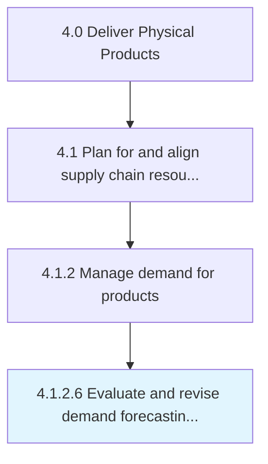

# Evaluate and revise demand forecasting approach

> Examining the methodology used to estimate future demand.

## Overview

Activity 4.1.2.6 is an activity within the Deliver Physical Products framework. 

Examining the methodology used to estimate future demand. Refine it in light of current market realities and demand.

## Process Hierarchy



## Key Statistics

| Metric | Value |
|--------|-------|
| APQC Code | 10240 |
| Hierarchy ID | 4.1.2.6 |
| Level | Activity |
| Parent | [4.1.2](../) |
| Sub-Processes | 0 |


## GraphDL Semantic Structure

```
evaluate.AndReviseDemandForecastingApproach
```

| Component | Value | Description |
|-----------|-------|-------------|
| Verb | `evaluate` | Primary action |
| Object | `and revise demand forecasting approach` | Direct object |


## Related Concepts

- DemandForecastingApproach
- DemandForecastingApproach


---

*Source: APQC PCF 10240 (4.1.2.6) - APQC*
