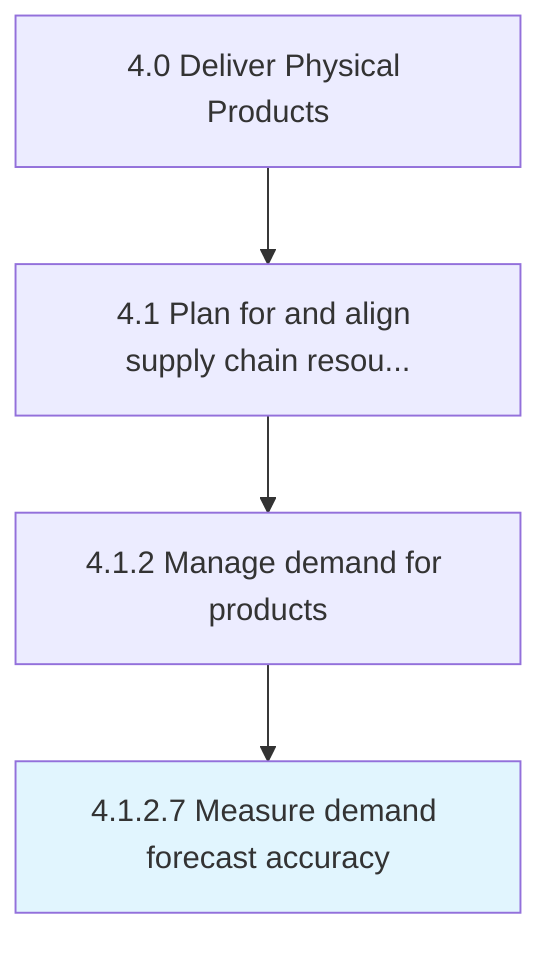

# Measure demand forecast accuracy

> Calculating and inspecting the accuracy of demand forecasts.

## Overview

Activity 4.1.2.7 is an activity within the Deliver Physical Products framework. 

Calculating and inspecting the accuracy of demand forecasts. Use metrics to check the reliability of the forecasts created.

## Process Hierarchy



## Key Statistics

| Metric | Value |
|--------|-------|
| APQC Code | 10241 |
| Hierarchy ID | 4.1.2.7 |
| Level | Activity |
| Parent | [4.1.2](../) |
| Sub-Processes | 0 |


## GraphDL Semantic Structure

```
measure.DemandForecastAccuracy
```

| Component | Value | Description |
|-----------|-------|-------------|
| Verb | `measure` | Primary action |
| Object | `demand forecast accuracy` | Direct object |


## Related Concepts

- [DemandForecastAccuracy](/concepts/DemandForecastAccuracy)


---

*Source: APQC PCF 10241 (4.1.2.7) - APQC*
