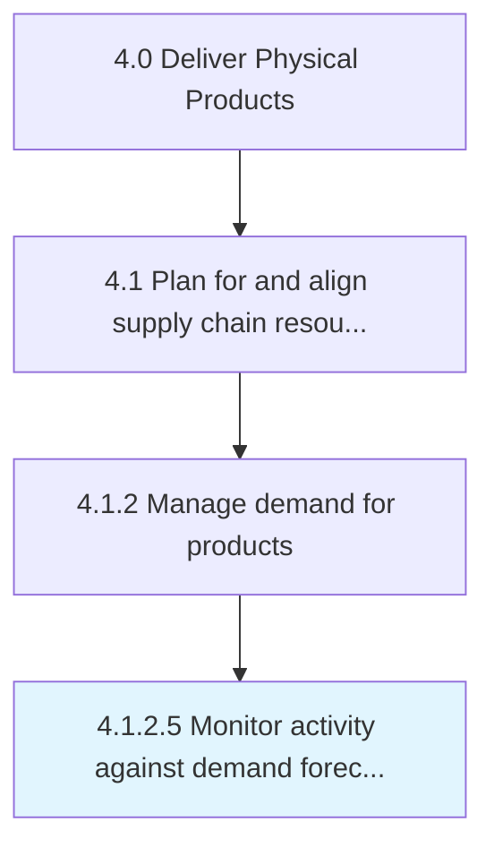

# Monitor activity against demand forecast and revise forecast

> Picking out any activity that deviates from the forecast, and adjusting it.

## Overview

Activity 4.1.2.5 is an activity within the Deliver Physical Products framework. 

Picking out any activity that deviates from the forecast, and adjusting it. Closely track and study the levels of demand as they emerge. Refine the consensus forecast as needed.

## Process Hierarchy



## Key Statistics

| Metric | Value |
|--------|-------|
| APQC Code | 10239 |
| Hierarchy ID | 4.1.2.5 |
| Level | Activity |
| Parent | [4.1.2](../) |
| Sub-Processes | 0 |


## GraphDL Semantic Structure

```
monitor.Activity.against.DemandForecastAndReviseForecast
```

| Component | Value | Description |
|-----------|-------|-------------|
| Verb | `monitor` | Primary action |
| Object | `activity` | Direct object |
| Preposition | `against` | Relationship |
| PrepObject | `demand forecast and revise forecast` | Indirect object |


## Related Concepts

- [Activity](/concepts/Activity)
- [DemandForecast](/concepts/DemandForecast)
- [ReviseForecast](/concepts/ReviseForecast)


---

*Source: APQC PCF 10239 (4.1.2.5) - APQC*
