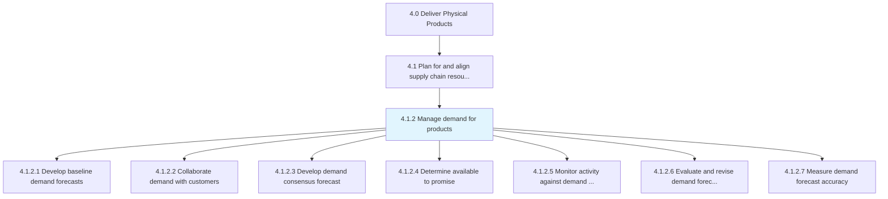
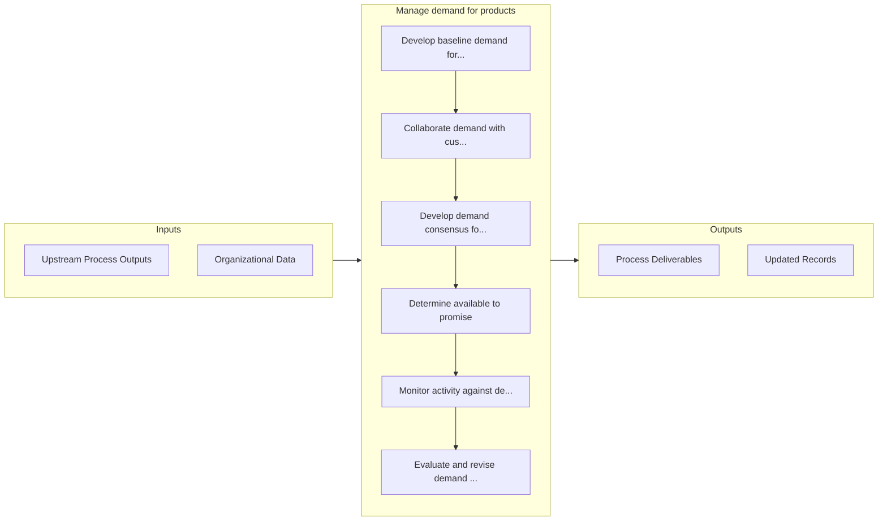

# Manage demand for products

> Forecasting demand for products using secondary research and customer feedback.

## Overview

Process 4.1.2 is a core process that defines the specific procedures for manage demand for products. 

Forecasting demand for products using secondary research and customer feedback. Refine these forecasts. Inspect the approach used in creating forecasts, and determine its accuracy.

## Process Hierarchy



## Key Statistics

| Metric | Value |
|--------|-------|
| APQC Code | 10222 |
| Hierarchy ID | 4.1.2 |
| Level | Process |
| Parent | [4.1](../) |
| Sub-Processes | 7 |


## GraphDL Semantic Structure

```
manage.Demand.for.Products
```

| Component | Value | Description |
|-----------|-------|-------------|
| Verb | `manage` | Primary action |
| Object | `demand` | Direct object |
| Preposition | `for` | Relationship |
| PrepObject | `products` | Indirect object |


## Process Flow



## Sub-Processes

| Process | Hierarchy ID | Description |
|---------|-------------|-------------|
| [Develop baseline demand forecasts](./DevelopBaselineDemandForecasts) | 4.1.2.1 | Identify the bedrock levels of market demand anticipated for the organization's products/services |
| [Collaborate demand with customers](./CollaborateDemandWithCustomers) | 4.1.2.2 | Working closely with the organization's customers to understand their drives and behavior, with the  |
| [Develop demand consensus forecast](./DevelopDemandConsensusForecast) | 4.1.2.3 | Arriving at a consensus over the forecasted levels of demand for products/services |
| [Determine available to promise](./DetermineAvailableToPromise) | 4.1.2.4 | Identify the volume of products/services that may be committed for delivery to fulfill sales |
| [Monitor activity against demand forecast and revise forecast](./MonitorActivityAgainstDemandForecastAndReviseForecast) | 4.1.2.5 | Picking out any activity that deviates from the forecast, and adjusting it |
| [Evaluate and revise demand forecasting approach](./EvaluateAndReviseDemandForecastingApproach) | 4.1.2.6 | Examining the methodology used to estimate future demand |
| [Measure demand forecast accuracy](./MeasureDemandForecastAccuracy) | 4.1.2.7 | Calculating and inspecting the accuracy of demand forecasts |


## Related Concepts

- [Demand](/concepts/Demand)
- [Products](/concepts/Products)


---

*Source: APQC PCF 10222 (4.1.2) - APQC*
