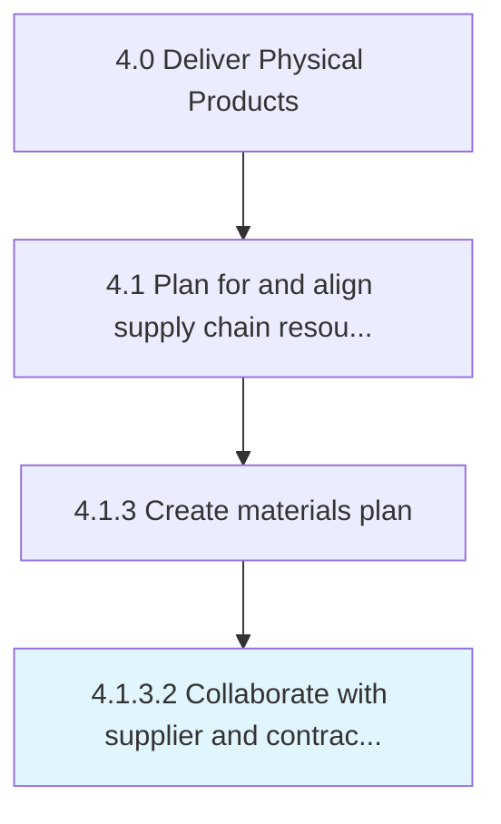

# Collaborate with supplier and contract manufacturers

> Collaborating with vendors and contractual manufacturers with the objective of ensuring a continual supply of raw materials and spares.

## Overview

Activity 4.1.3.2 is an activity within the Deliver Physical Products framework. 

Collaborating with vendors and contractual manufacturers with the objective of ensuring a continual supply of raw materials and spares. Leverage long-term connections/relationships with various suppliers, and cultivate new ones. Track the activities of all vendors. Receive regular updates to prepare for any fluctuations in supply.

## Process Hierarchy



## Key Statistics

| Metric | Value |
|--------|-------|
| APQC Code | 10243 |
| Hierarchy ID | 4.1.3.2 |
| Level | Activity |
| Parent | [4.1.3](../) |
| Sub-Processes | 0 |


## GraphDL Semantic Structure

```
collaborate.WithSupplierAndContractManufacturers
```

| Component | Value | Description |
|-----------|-------|-------------|
| Verb | `collaborate` | Primary action |
| Object | `with supplier and contract manufacturers` | Direct object |


## Related Concepts

- [Supplier](/concepts/Supplier)
- [ContractManufacturers](/concepts/ContractManufacturers)


---

*Source: APQC PCF 10243 (4.1.3.2) - APQC*
