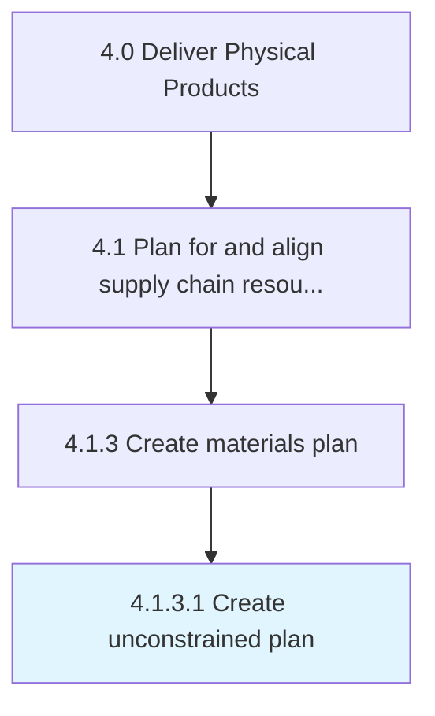

# Create unconstrained plan

> Developing a plan for raw materials and other inventory items in order to meet market demand.

## Overview

Activity 4.1.3.1 is an activity within the Deliver Physical Products framework. 

Developing a plan for raw materials and other inventory items in order to meet market demand. Ensure the availability of all inventory items such as raw materials and spares. Create a blueprint in line with Define labor and materials policies [10230].

## Process Hierarchy



## Key Statistics

| Metric | Value |
|--------|-------|
| APQC Code | 10242 |
| Hierarchy ID | 4.1.3.1 |
| Level | Activity |
| Parent | [4.1.3](../) |
| Sub-Processes | 0 |


## GraphDL Semantic Structure

```
create.UnconstrainedPlan
```

| Component | Value | Description |
|-----------|-------|-------------|
| Verb | `create` | Primary action |
| Object | `unconstrained plan` | Direct object |


## Related Concepts

- [UnconstrainedPlan](/concepts/UnconstrainedPlan)


---

*Source: APQC PCF 10242 (4.1.3.1) - APQC*
