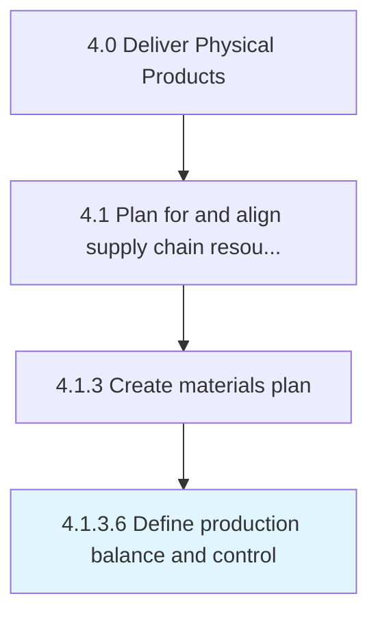

# Define production balance and control

> Defining an equitable volume for the production of products/services that adheres to an equilibrium value, and creating a scheme of control for processing items.

## Overview

Activity 4.1.3.6 is an activity within the Deliver Physical Products framework. 

Defining an equitable volume for the production of products/services that adheres to an equilibrium value, and creating a scheme of control for processing items. Create schematics for systematically planning, coordinating, and directing the manufacturing activities in line with the production balance determined.

## Process Hierarchy



## Key Statistics

| Metric | Value |
|--------|-------|
| APQC Code | 14196 |
| Hierarchy ID | 4.1.3.6 |
| Level | Activity |
| Parent | [4.1.3](../) |
| Sub-Processes | 0 |


## GraphDL Semantic Structure

```
define.ProductionBalanceAndControl
```

| Component | Value | Description |
|-----------|-------|-------------|
| Verb | `define` | Primary action |
| Object | `production balance and control` | Direct object |


## Related Concepts

- [ProductionBalance](/concepts/ProductionBalance)
- [Control](/concepts/Control)


---

*Source: APQC PCF 14196 (4.1.3.6) - APQC*
