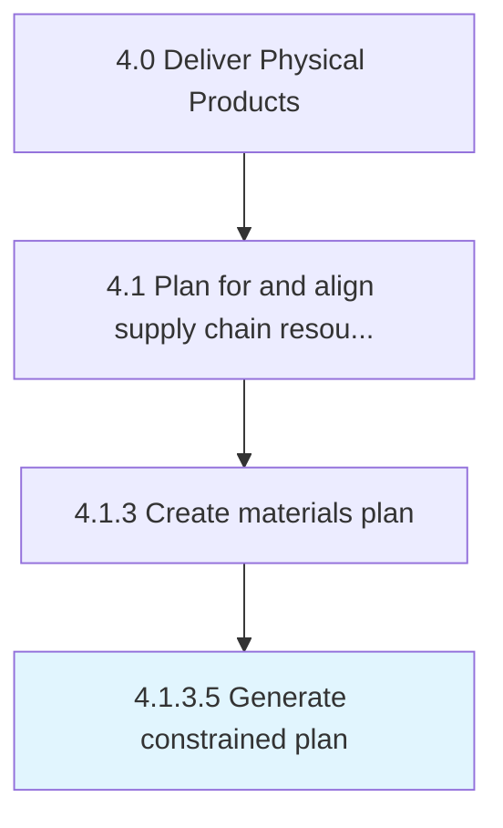

# Generate constrained plan

> Generating a bounded plan that takes stock of the actual supply chain scenario.

## Overview

Activity 4.1.3.5 is an activity within the Deliver Physical Products framework. 

Generating a bounded plan that takes stock of the actual supply chain scenario. Take stock of all information collected while creating an inventory supply plan.

## Process Hierarchy



## Key Statistics

| Metric | Value |
|--------|-------|
| APQC Code | 10246 |
| Hierarchy ID | 4.1.3.5 |
| Level | Activity |
| Parent | [4.1.3](../) |
| Sub-Processes | 0 |


## GraphDL Semantic Structure

```
generate.ConstrainedPlan
```

| Component | Value | Description |
|-----------|-------|-------------|
| Verb | `generate` | Primary action |
| Object | `constrained plan` | Direct object |


## Related Concepts

- [ConstrainedPlan](/concepts/ConstrainedPlan)


---

*Source: APQC PCF 10246 (4.1.3.5) - APQC*
