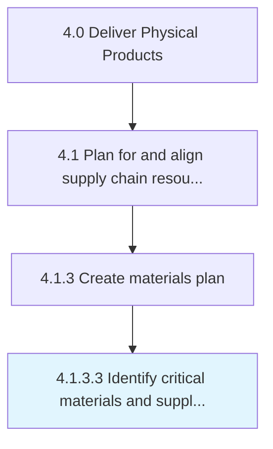

# Identify critical materials and supplier capacity

> Identifying principal materials needed for the manufacturing process and the levels of supply that may be ensured for them.

## Overview

Activity 4.1.3.3 is an activity within the Deliver Physical Products framework. 

Identifying principal materials needed for the manufacturing process and the levels of supply that may be ensured for them. Determine the essential and crucial inventory items required for the smooth functioning of all manufacturing processes. Estimate the average, peak, and baseline capacities of various vendors and suppliers. Establish the capability of individual suppliers from the market and the vendors.

## Process Hierarchy



## Key Statistics

| Metric | Value |
|--------|-------|
| APQC Code | 10244 |
| Hierarchy ID | 4.1.3.3 |
| Level | Activity |
| Parent | [4.1.3](../) |
| Sub-Processes | 0 |


## GraphDL Semantic Structure

```
identify.CriticalMaterialsAndSupplierCapacity
```

| Component | Value | Description |
|-----------|-------|-------------|
| Verb | `identify` | Primary action |
| Object | `critical materials and supplier capacity` | Direct object |


## Related Concepts

- [CriticalMaterialsCapacity](/concepts/CriticalMaterialsCapacity)
- [SupplierCapacity](/concepts/SupplierCapacity)


---

*Source: APQC PCF 10244 (4.1.3.3) - APQC*
