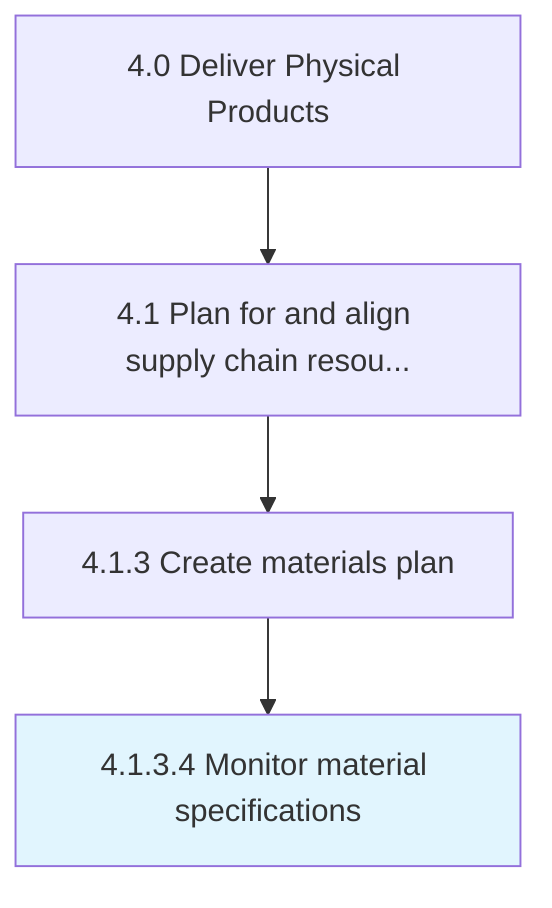

# Monitor material specifications

> Observing and surveying all inventory items in order to check for the veracity of their specifications.

## Overview

Activity 4.1.3.4 is an activity within the Deliver Physical Products framework. 

Observing and surveying all inventory items in order to check for the veracity of their specifications. Monitor various attributes and characteristics for respective inventory items such as density, volume, and size, as well as contextualized specifications particular to the respective materials.

## Process Hierarchy



## Key Statistics

| Metric | Value |
|--------|-------|
| APQC Code | 10245 |
| Hierarchy ID | 4.1.3.4 |
| Level | Activity |
| Parent | [4.1.3](../) |
| Sub-Processes | 0 |


## GraphDL Semantic Structure

```
monitor.MaterialSpecifications
```

| Component | Value | Description |
|-----------|-------|-------------|
| Verb | `monitor` | Primary action |
| Object | `material specifications` | Direct object |


## Related Concepts

- MaterialSpecifications


---

*Source: APQC PCF 10245 (4.1.3.4) - APQC*
