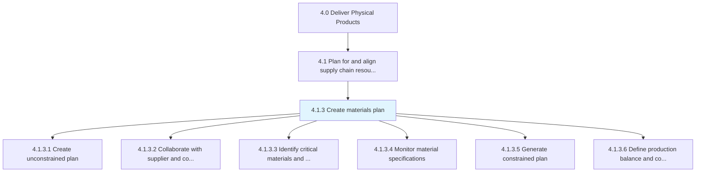
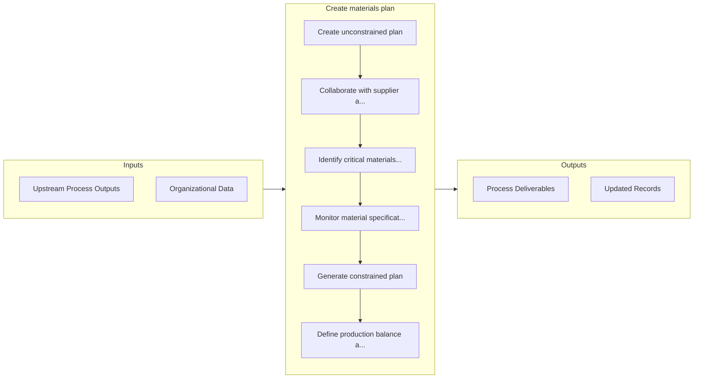

# Create materials plan

> Developing a scheme that allows for advance planning for the availability of raw materials and spares.

## Overview

Process 4.1.3 is a core process that defines the specific procedures for create materials plan. 

Developing a scheme that allows for advance planning for the availability of raw materials and spares. Start with an unconstrained plan, and refine based on supply chain realities by identifying critical materials required for production, checking material specifications, and collaborating with all vendors over the supply.

## Process Hierarchy



## Key Statistics

| Metric | Value |
|--------|-------|
| APQC Code | 10223 |
| Hierarchy ID | 4.1.3 |
| Level | Process |
| Parent | [4.1](../) |
| Sub-Processes | 6 |


## GraphDL Semantic Structure

```graphdl
create.MaterialsPlan
```

| Component | Value | Description |
|-----------|-------|-------------|
| Verb | `create` | Primary action |
| Object | `materials plan` | Direct object |


## Process Flow



## Sub-Processes

| Process | Hierarchy ID | Description |
|---------|-------------|-------------|
| [Create unconstrained plan](./CreateUnconstrainedPlan) | 4.1.3.1 | Developing a plan for raw materials and other inventory items in order to meet market demand |
| [Collaborate with supplier and contract manufacturers](./CollaborateWithSupplierAndContractManufacturers) | 4.1.3.2 | Collaborating with vendors and contractual manufacturers with the objective of ensuring a continual  |
| [Identify critical materials and supplier capacity](./IdentifyCriticalMaterialsAndSupplierCapacity) | 4.1.3.3 | Identifying principal materials needed for the manufacturing process and the levels of supply that m |
| [Monitor material specifications](./MonitorMaterialSpecifications) | 4.1.3.4 | Observing and surveying all inventory items in order to check for the veracity of their specificatio |
| [Generate constrained plan](./GenerateConstrainedPlan) | 4.1.3.5 | Generating a bounded plan that takes stock of the actual supply chain scenario |
| [Define production balance and control](./DefineProductionBalanceAndControl) | 4.1.3.6 | Defining an equitable volume for the production of products/services that adheres to an equilibrium  |


## Related Concepts

- MaterialsPlan


---

*Source: APQC PCF 10223 (4.1.3) - APQC*
