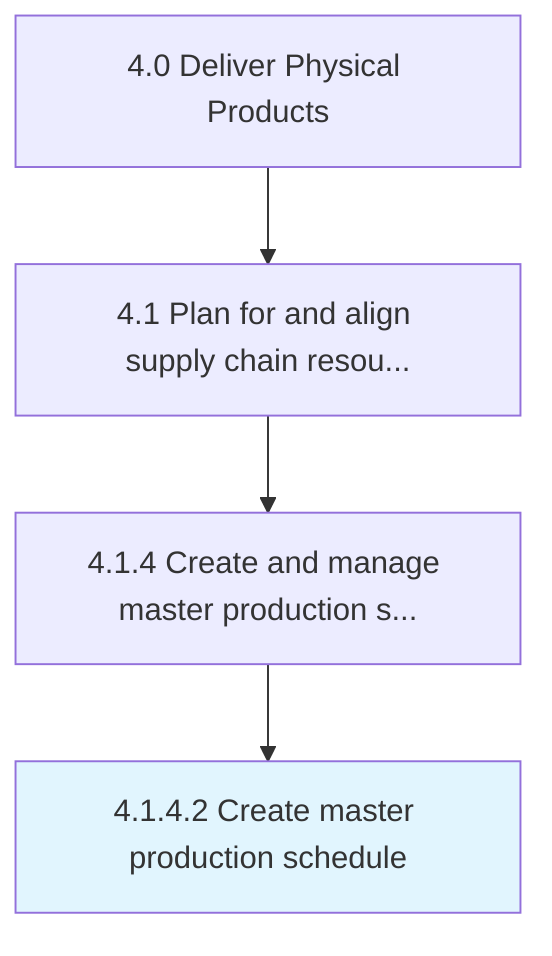

# Create master production schedule

> Creating the plan for internal activities such as production, inventory, and staffing.

## Overview

Activity 4.1.4.2 is an activity within the Deliver Physical Products framework. 

Creating the plan for internal activities such as production, inventory, and staffing. Include forecasted quantity of items to produce based on inputs from sales planning, demand planning/forecasting, and supply chain partners.

## Process Hierarchy



## Key Statistics

| Metric | Value |
|--------|-------|
| APQC Code | 20024 |
| Hierarchy ID | 4.1.4.2 |
| Level | Activity |
| Parent | [4.1.4](../) |
| Sub-Processes | 0 |


## GraphDL Semantic Structure

```
create.MasterProductionSchedule
```

| Component | Value | Description |
|-----------|-------|-------------|
| Verb | `create` | Primary action |
| Object | `master production schedule` | Direct object |


## Related Concepts

- [MasterProductionSchedule](/concepts/MasterProductionSchedule)


---

*Source: APQC PCF 20024 (4.1.4.2) - APQC*
