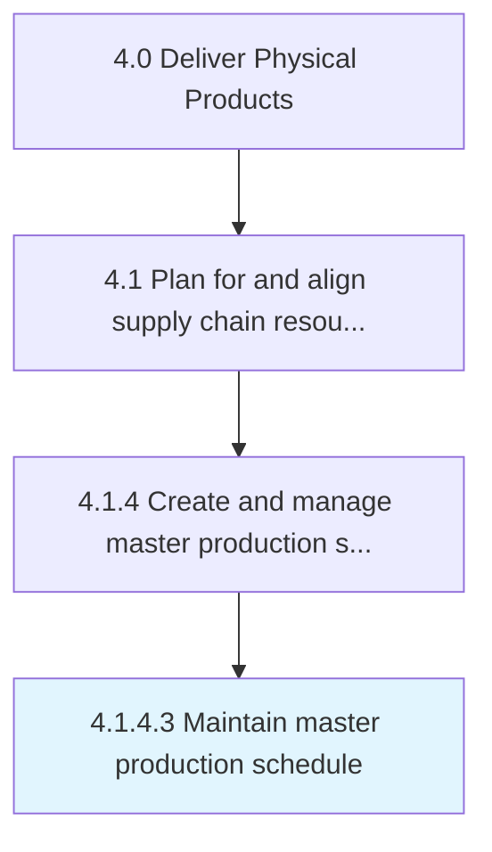

# Maintain master production schedule

> Supervising and overseeing the plan for internal activities such as production, inventory, and staffing.

## Overview

Activity 4.1.4.3 is an activity within the Deliver Physical Products framework. 

Supervising and overseeing the plan for internal activities such as production, inventory, and staffing. Set the quantity of items to produce each week of a short-range planning horizon.

## Process Hierarchy



## Key Statistics

| Metric | Value |
|--------|-------|
| APQC Code | 17041 |
| Hierarchy ID | 4.1.4.3 |
| Level | Activity |
| Parent | [4.1.4](../) |
| Sub-Processes | 0 |


## GraphDL Semantic Structure

```
maintain.MasterProductionSchedule
```

| Component | Value | Description |
|-----------|-------|-------------|
| Verb | `maintain` | Primary action |
| Object | `master production schedule` | Direct object |


## Related Concepts

- [MasterProductionSchedule](/concepts/MasterProductionSchedule)


---

*Source: APQC PCF 17041 (4.1.4.3) - APQC*
