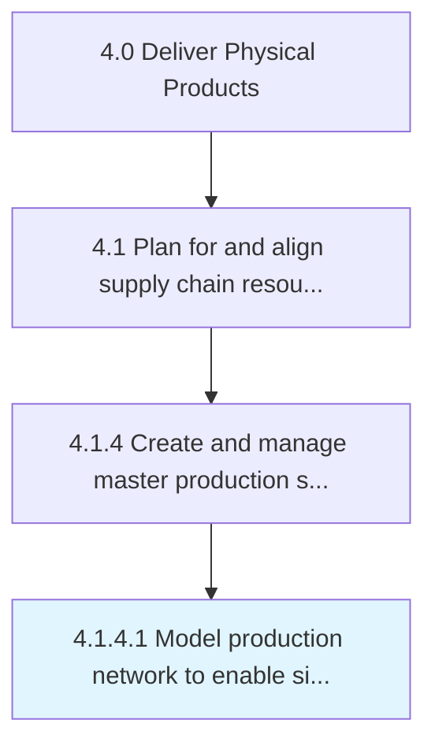

# Model production network to enable simulation and optimization

> Create representative logical system that provides the framework to attain strategic objectives based on resources, product volumes, and processes.

## Overview

Activity 4.1.4.1 is an activity within the Deliver Physical Products framework. 

Create representative logical system that provides the framework to attain strategic objectives based on resources, product volumes, and processes. Provides the general sequential flow and capacity requirement relationships among raw materials, parts, resources, finished products, and product families.

## Process Hierarchy



## Key Statistics

| Metric | Value |
|--------|-------|
| APQC Code | 20023 |
| Hierarchy ID | 4.1.4.1 |
| Level | Activity |
| Parent | [4.1.4](../) |
| Sub-Processes | 0 |


## GraphDL Semantic Structure

```
model.ProductionNetwork.to.EnableSimulationAndOptimization
```

| Component | Value | Description |
|-----------|-------|-------------|
| Verb | `model` | Primary action |
| Object | `production network` | Direct object |
| Preposition | `to` | Relationship |
| PrepObject | `enable simulation and optimization` | Indirect object |


## Related Concepts

- ProductionNetwork
- EnableSimulation
- ProductionNetwork
- Optimization


---

*Source: APQC PCF 20023 (4.1.4.1) - APQC*
