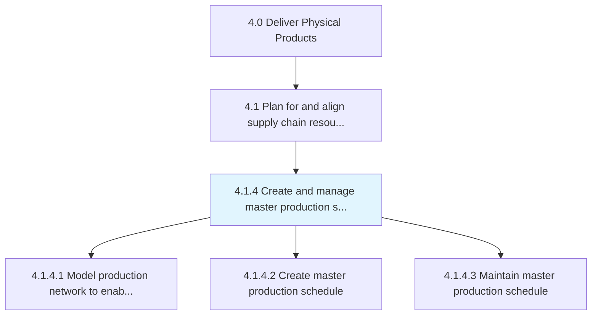
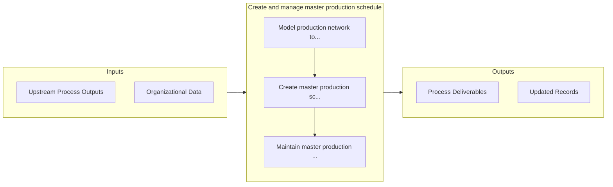

# Create and manage master production schedule

> Taking care of the master production plan.

## Overview

Process 4.1.4 is a core process that defines the specific procedures for create and manage master production schedule. 

Taking care of the master production plan. The master production includes creation and implementation of the site-level production plan, as well as management of the inventory that is currently in the production process.

## Process Hierarchy



## Key Statistics

| Metric | Value |
|--------|-------|
| APQC Code | 10224 |
| Hierarchy ID | 4.1.4 |
| Level | Process |
| Parent | [4.1](../) |
| Sub-Processes | 3 |


## GraphDL Semantic Structure

```graphdl
create.AndManageMasterProductionSchedule
```

| Component | Value | Description |
|-----------|-------|-------------|
| Verb | `create` | Primary action |
| Object | `and manage master production schedule` | Direct object |


## Process Flow



## Sub-Processes

| Process | Hierarchy ID | Description |
|---------|-------------|-------------|
| [Model production network to enable simulation and optimization](./ModelProductionNetworkToEnableSimulationAndOptimization) | 4.1.4.1 | Create representative logical system that provides the framework to attain strategic objectives base |
| [Create master production schedule](./CreateMasterProductionSchedule) | 4.1.4.2 | Creating the plan for internal activities such as production, inventory, and staffing |
| [Maintain master production schedule](./MaintainMasterProductionSchedule) | 4.1.4.3 | Supervising and overseeing the plan for internal activities such as production, inventory, and staff |


## Related Concepts

- MasterProductionSchedule
- MasterProductionSchedule


---

*Source: APQC PCF 10224 (4.1.4) - APQC*
