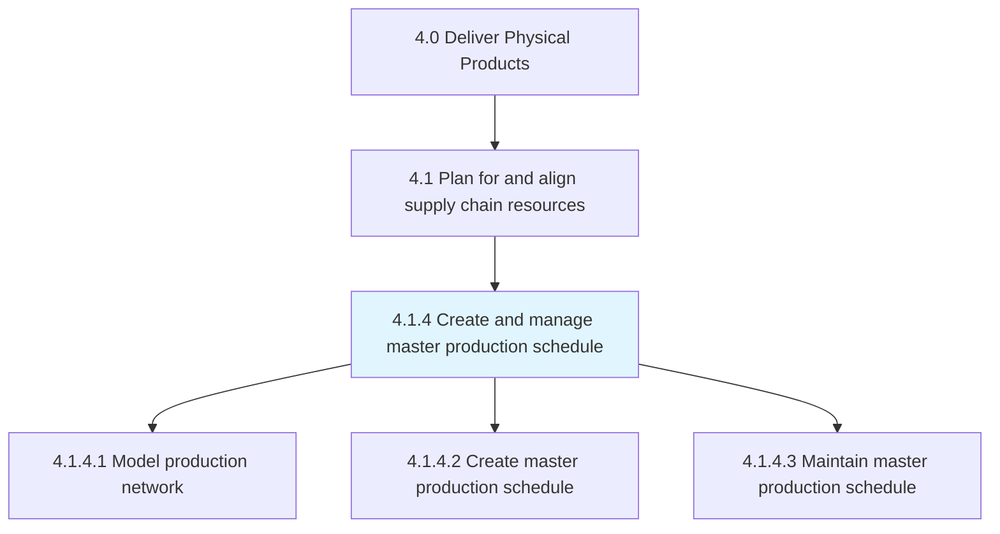
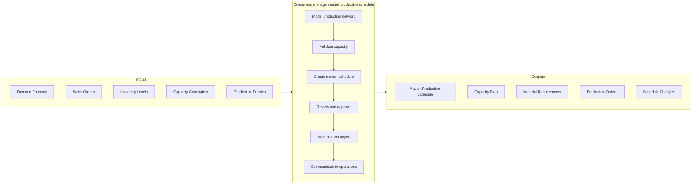

# Create and manage master production schedule

> Taking care of the master production plan.

## Overview

Process 4.1.4 is a core process within [Plan for and Align Supply Chain Resources](../) that translates demand plans into actionable production schedules. The Master Production Schedule (MPS) serves as the primary driver for manufacturing operations, specifying what products to produce, in what quantities, and when.

The MPS bridges strategic planning with operational execution by balancing customer demand, inventory targets, and production capacity. It establishes the rhythm of manufacturing operations and triggers material requirements planning (MRP). Effective MPS management requires continuous monitoring and adjustment to respond to demand changes, supply disruptions, and capacity constraints while maintaining schedule stability.

## Process Hierarchy



## Key Statistics

| Metric | Value |
|--------|-------|
| APQC Code | 10224 |
| Hierarchy ID | 4.1.4 |
| Level | Process |
| Parent | [4.1](../) |
| Sub-Processes | 3 |

## GraphDL Semantic Structure

```graphdl
create.MasterProductionSchedule.for.Manufacturing
```

| Component | Value | Description |
|-----------|-------|-------------|
| Verb | `create` | Primary action of establishing |
| Object | `MasterProductionSchedule` | Production planning document |
| Preposition | `for` | Purpose relationship |
| PrepObject | `Manufacturing` | Production operations |

## Process Flow



## Sub-Processes

| Process | Hierarchy ID | Description |
|---------|-------------|-------------|
| [Model production network for simulation](./ModelProductionNetworkToEnableSimulationAndOptimization) | 4.1.4.1 | Creating models to test scenarios and optimize production plans |
| [Create master production schedule](./CreateMasterProductionSchedule) | 4.1.4.2 | Developing the time-phased production plan for finished goods |
| [Maintain master production schedule](./MaintainMasterProductionSchedule) | 4.1.4.3 | Updating and managing the schedule as conditions change |

## RACI Matrix

| Activity | Responsible | Accountable | Consulted | Informed |
|----------|-------------|-------------|-----------|----------|
| Model production network | Supply Chain Planning | Planning Director | IT, Operations | Manufacturing |
| Develop initial MPS | Master Scheduler | Planning Director | Sales, Manufacturing | Procurement |
| Validate capacity | Production Planning | Plant Manager | Manufacturing | Master Scheduler |
| Approve MPS | Planning Director | VP Operations | Sales, Finance | All |
| Manage MPS changes | Master Scheduler | Planning Director | Sales, Operations | Manufacturing |
| Communicate schedule | Master Scheduler | Planning Director | All | Production |

## Key Stakeholders

- **Master Scheduler**: Creates and maintains the production schedule
- **Production Planning**: Provides capacity input and executes schedule
- **Sales/Demand Planning**: Provides demand inputs and requirements
- **Procurement**: Plans materials based on MPS
- **Manufacturing**: Executes the production schedule
- **Finance**: Monitors inventory and cost implications

## Metrics and KPIs

| Metric | Description | Target |
|--------|-------------|--------|
| Schedule Adherence | Actual vs. planned production | >95% |
| MPS Stability | Schedule changes within frozen period | <5% |
| Capacity Utilization | Planned vs. available capacity | 80-90% |
| Forecast Accuracy | MPS vs. actual demand | >85% |
| Inventory Days on Hand | Finished goods inventory coverage | Per policy |
| Order Fill Rate | Orders filled from MPS | >98% |
| Planning Cycle Time | Time to generate MPS | <1 day |
| MPS Horizon Coverage | Weeks of schedule visibility | >12 weeks |

## Related Departments

- [Supply Chain Planning](/departments/SupplyChain/Planning) - MPS development
- [Manufacturing](/departments/Operations/Manufacturing) - Schedule execution
- [Sales](/departments/Sales) - Demand requirements
- [Procurement](/departments/Procurement) - Material planning

## Related Occupations

- [Industrial Production Managers](/occupations/Management/IndustrialProductionManagers) - Production oversight
- [Logisticians](/occupations/Business/Logisticians) - Production planning
- [Operations Research Analysts](/occupations/Math/OperationsResearchAnalysts) - Schedule optimization
- [Supply Chain Managers](/occupations/Management/SupplyChainManagers) - Planning coordination

## Industry Variations

### Discrete Manufacturing
MPS at end-item or option level, configuration management, and coordination with complex BOMs for assembled products.

### Process Manufacturing
Batch scheduling, campaign planning, and coordination of shared equipment across multiple products.

### Make-to-Order
MPS driven by customer orders with lead time management and Available-to-Promise (ATP) integration.

### Repetitive Manufacturing
Rate-based scheduling, level loading, and kanban integration for high-volume, low-variety production.

## Related Concepts

- MasterScheduling
- ProductionPlanning
- CapacityPlanning
- MaterialRequirementsPlanning
- DemandManagement
- ScheduleStability
- AvailableToPromise

---

*Source: APQC PCF 10224 (4.1.4) - APQC*
