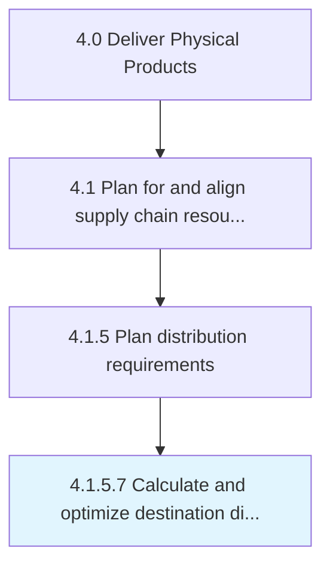

# Calculate and optimize destination dispatch plan

> Estimating the timing and duration of the delivery of the inventory from the source to the destination.

## Overview

Activity 4.1.5.7 is an activity within the Deliver Physical Products framework. 

Estimating the timing and duration of the delivery of the inventory from the source to the destination. Plan the logistic details of all the distribution routes and activities.

## Process Hierarchy



## Key Statistics

| Metric | Value |
|--------|-------|
| APQC Code | 10258 |
| Hierarchy ID | 4.1.5.7 |
| Level | Activity |
| Parent | [4.1.5](../) |
| Sub-Processes | 0 |


## GraphDL Semantic Structure

```
calculate.AndOptimizeDestinationDispatchPlan
```

| Component | Value | Description |
|-----------|-------|-------------|
| Verb | `calculate` | Primary action |
| Object | `and optimize destination dispatch plan` | Direct object |


## Related Concepts

- [DestinationDispatchPlan](/concepts/DestinationDispatchPlan)
- [DestinationDispatchPlan](/concepts/DestinationDispatchPlan)


---

*Source: APQC PCF 10258 (4.1.5.7) - APQC*
