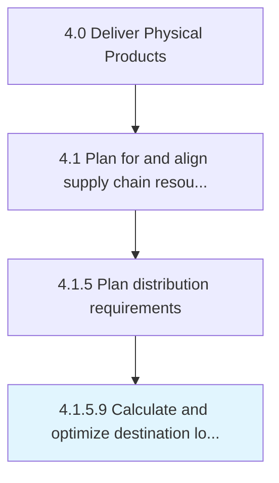

# Calculate and optimize destination load plans

> Evaluating the plans for delivering loads to destinations.

## Overview

Activity 4.1.5.9 is an activity within the Deliver Physical Products framework. 

Evaluating the plans for delivering loads to destinations. Create a systematic plan that specifies the load plans for every single destination.

## Process Hierarchy



## Key Statistics

| Metric | Value |
|--------|-------|
| APQC Code | 10260 |
| Hierarchy ID | 4.1.5.9 |
| Level | Activity |
| Parent | [4.1.5](../) |
| Sub-Processes | 0 |


## GraphDL Semantic Structure

```
calculate.AndOptimizeDestinationLoadPlans
```

| Component | Value | Description |
|-----------|-------|-------------|
| Verb | `calculate` | Primary action |
| Object | `and optimize destination load plans` | Direct object |


## Related Concepts

- DestinationLoadPlans
- DestinationLoadPlans


---

*Source: APQC PCF 10260 (4.1.5.9) - APQC*
