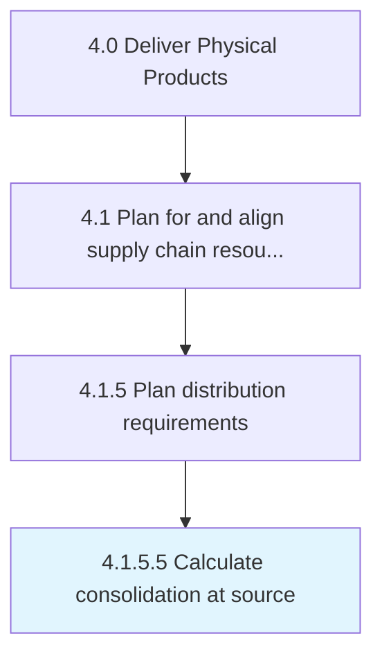

# Calculate consolidation at source

> Determining the aggregate volume of products/services consolidated at the source.

## Overview

Activity 4.1.5.5 is an activity within the Deliver Physical Products framework. 

Determining the aggregate volume of products/services consolidated at the source. Calculate the number of finished products that are ready to be delivered to the customers, particularly at one date.

## Process Hierarchy



## Key Statistics

| Metric | Value |
|--------|-------|
| APQC Code | 10255 |
| Hierarchy ID | 4.1.5.5 |
| Level | Activity |
| Parent | [4.1.5](../) |
| Sub-Processes | 0 |


## GraphDL Semantic Structure

```
calculate.ConsolidationAtSource
```

| Component | Value | Description |
|-----------|-------|-------------|
| Verb | `calculate` | Primary action |
| Object | `consolidation at source` | Direct object |


## Related Concepts

- [Consolidation](/concepts/Consolidation)
- [Source](/concepts/Source)


---

*Source: APQC PCF 10255 (4.1.5.5) - APQC*
