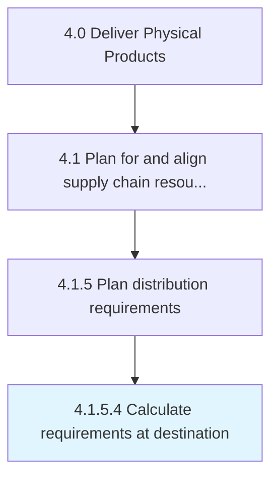

# Calculate requirements at destination

> Interact with the concerned authority at the destination to reach a specific figure that correctly represents requirements.

## Overview

Activity 4.1.5.4 is an activity within the Deliver Physical Products framework. 

Interact with the concerned authority at the destination to reach a specific figure that correctly represents requirements.

## Process Hierarchy



## Key Statistics

| Metric | Value |
|--------|-------|
| APQC Code | 10254 |
| Hierarchy ID | 4.1.5.4 |
| Level | Activity |
| Parent | [4.1.5](../) |
| Sub-Processes | 0 |


## GraphDL Semantic Structure

```
calculate.RequirementsAtDestination
```

| Component | Value | Description |
|-----------|-------|-------------|
| Verb | `calculate` | Primary action |
| Object | `requirements at destination` | Direct object |


## Related Concepts

- Requirements
- Destination


---

*Source: APQC PCF 10254 (4.1.5.4) - APQC*
