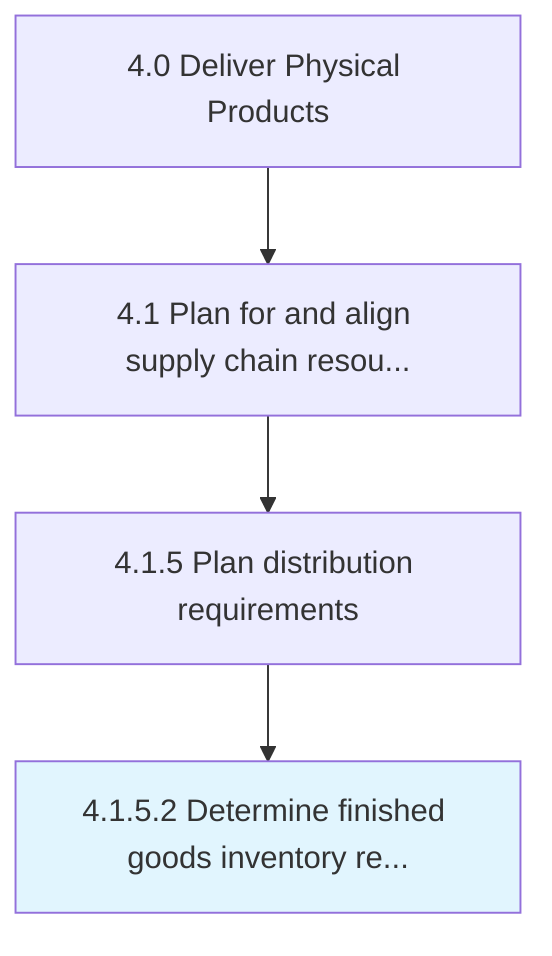

# Determine finished goods inventory requirements at destination

> Interact with the concerned person at the destination to validate the requirements and to avoid any miscommunication of information.

## Overview

Activity 4.1.5.2 is an activity within the Deliver Physical Products framework. 

Interact with the concerned person at the destination to validate the requirements and to avoid any miscommunication of information.

## Process Hierarchy



## Key Statistics

| Metric | Value |
|--------|-------|
| APQC Code | 10253 |
| Hierarchy ID | 4.1.5.2 |
| Level | Activity |
| Parent | [4.1.5](../) |
| Sub-Processes | 0 |


## GraphDL Semantic Structure

```
determine.FinishedGoodsInventoryRequirementsAtDestination
```

| Component | Value | Description |
|-----------|-------|-------------|
| Verb | `determine` | Primary action |
| Object | `finished goods inventory requirements at destination` | Direct object |


## Related Concepts

- FinishedGoodsInventoryRequirements
- Destination


---

*Source: APQC PCF 10253 (4.1.5.2) - APQC*
