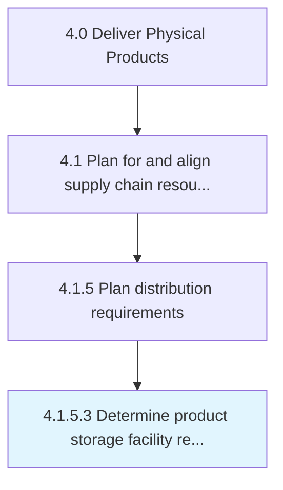

# Determine product storage facility requirements

> Evaluate constraints, needs, parameters, and conditions for physical storage and retrieval of components or products for future use or shipment in a storage facility within a certain timeframe.

## Overview

Activity 4.1.5.3 is an activity within the Deliver Physical Products framework. 

Evaluate constraints, needs, parameters, and conditions for physical storage and retrieval of components or products for future use or shipment in a storage facility within a certain timeframe.

## Process Hierarchy



## Key Statistics

| Metric | Value |
|--------|-------|
| APQC Code | 19555 |
| Hierarchy ID | 4.1.5.3 |
| Level | Activity |
| Parent | [4.1.5](../) |
| Sub-Processes | 0 |


## GraphDL Semantic Structure

```
determine.ProductStorageFacilityRequirements
```

| Component | Value | Description |
|-----------|-------|-------------|
| Verb | `determine` | Primary action |
| Object | `product storage facility requirements` | Direct object |


## Related Concepts

- ProductStorageFacilityRequirements


---

*Source: APQC PCF 19555 (4.1.5.3) - APQC*
