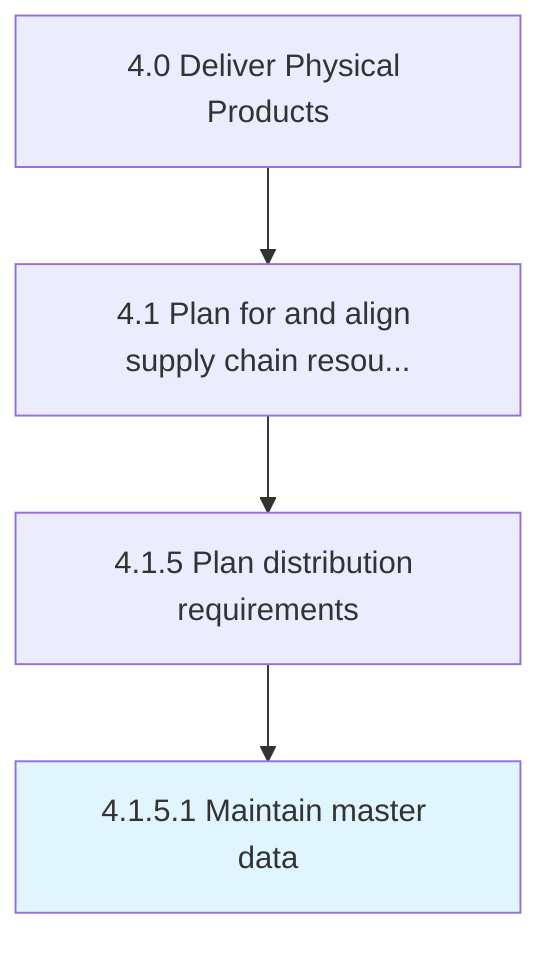

# Maintain master data

> Maintaining and preserving the master data plan for distribution requirements.

## Overview

Activity 4.1.5.1 is an activity within the Deliver Physical Products framework. 

Maintaining and preserving the master data plan for distribution requirements. Create a systematic collection of facts and figures regarding the distribution of the inventories. Maintain policies, processes, and tools covering the distribution function.

## Process Hierarchy



## Key Statistics

| Metric | Value |
|--------|-------|
| APQC Code | 10252 |
| Hierarchy ID | 4.1.5.1 |
| Level | Activity |
| Parent | [4.1.5](../) |
| Sub-Processes | 0 |


## GraphDL Semantic Structure

```
maintain.MasterData
```

| Component | Value | Description |
|-----------|-------|-------------|
| Verb | `maintain` | Primary action |
| Object | `master data` | Direct object |


## Related Concepts

- MasterData


---

*Source: APQC PCF 10252 (4.1.5.1) - APQC*
