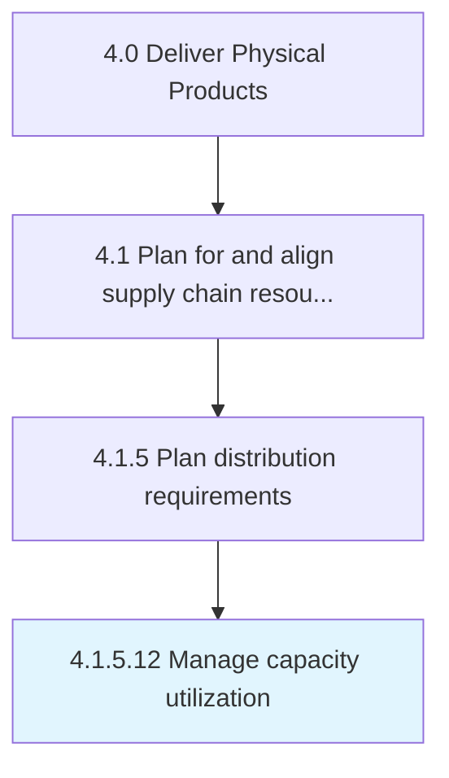

# Manage capacity utilization

> Determining the capacity utilization of the organization's production process.

## Overview

Activity 4.1.5.12 is an activity within the Deliver Physical Products framework. 

Determining the capacity utilization of the organization's production process. Realize the extent to which an enterprise uses its installed productive capacity (i.e., the relationship between output and the potential output if capacity was fully used).

## Process Hierarchy



## Key Statistics

| Metric | Value |
|--------|-------|
| APQC Code | 10263 |
| Hierarchy ID | 4.1.5.12 |
| Level | Activity |
| Parent | [4.1.5](../) |
| Sub-Processes | 0 |


## GraphDL Semantic Structure

```
manage.CapacityUtilization
```

| Component | Value | Description |
|-----------|-------|-------------|
| Verb | `manage` | Primary action |
| Object | `capacity utilization` | Direct object |


## Related Concepts

- CapacityUtilization


---

*Source: APQC PCF 10263 (4.1.5.12) - APQC*
