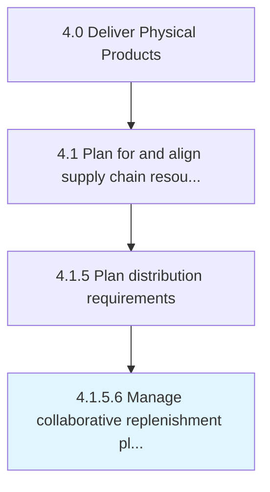

# Manage collaborative replenishment planning

> Administering the plan for collaborative replenishment of goods.

## Overview

Activity 4.1.5.6 is an activity within the Deliver Physical Products framework. 

Administering the plan for collaborative replenishment of goods. Replenish inventory by creating a plan in case of faulty production.

## Process Hierarchy



## Key Statistics

| Metric | Value |
|--------|-------|
| APQC Code | 10256 |
| Hierarchy ID | 4.1.5.6 |
| Level | Activity |
| Parent | [4.1.5](../) |
| Sub-Processes | 0 |


## GraphDL Semantic Structure

```
manage.CollaborativeReplenishmentPlanning
```

| Component | Value | Description |
|-----------|-------|-------------|
| Verb | `manage` | Primary action |
| Object | `collaborative replenishment planning` | Direct object |


## Related Concepts

- CollaborativeReplenishmentPlanning


---

*Source: APQC PCF 10256 (4.1.5.6) - APQC*
