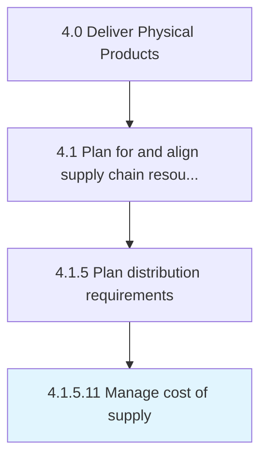

# Manage cost of supply

> Managing all expenses to provide products/services in the market.

## Overview

Activity 4.1.5.11 is an activity within the Deliver Physical Products framework. 

Managing all expenses to provide products/services in the market. Estimate the overall cost of supplying of products/inventory, including the cost distributing it through various partners and channels. Consider the cost of all the logistical processes that occur from the moment a product is ready to be dispatched to the time it reaches the destination.

## Process Hierarchy



## Key Statistics

| Metric | Value |
|--------|-------|
| APQC Code | 10262 |
| Hierarchy ID | 4.1.5.11 |
| Level | Activity |
| Parent | [4.1.5](../) |
| Sub-Processes | 0 |


## GraphDL Semantic Structure

```
manage.Cost.of.Supply
```

| Component | Value | Description |
|-----------|-------|-------------|
| Verb | `manage` | Primary action |
| Object | `cost` | Direct object |
| Preposition | `of` | Relationship |
| PrepObject | `supply` | Indirect object |


## Related Concepts

- [Cost](/concepts/Cost)
- [Supply](/concepts/Supply)


---

*Source: APQC PCF 10262 (4.1.5.11) - APQC*
