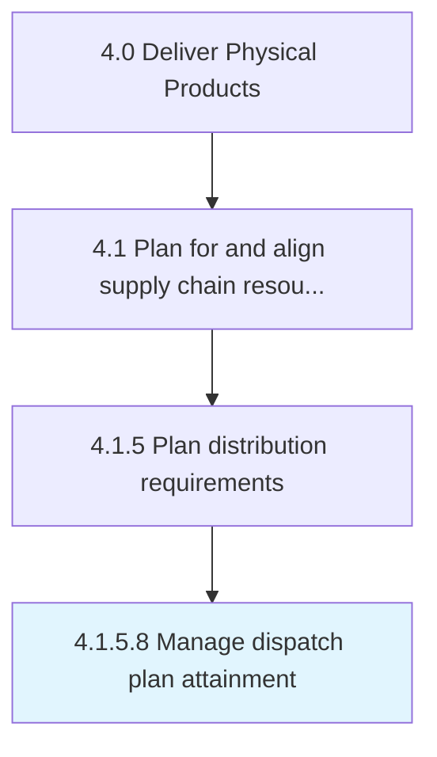

# Manage dispatch plan attainment

> Accomplishing the dispatch plan.

## Overview

Activity 4.1.5.8 is an activity within the Deliver Physical Products framework. 

Accomplishing the dispatch plan. Strictly follow the schedule, and adjust for deviations. Coordinate with the concerned authorities at various destinations.

## Process Hierarchy



## Key Statistics

| Metric | Value |
|--------|-------|
| APQC Code | 10259 |
| Hierarchy ID | 4.1.5.8 |
| Level | Activity |
| Parent | [4.1.5](../) |
| Sub-Processes | 0 |


## GraphDL Semantic Structure

```
manage.DispatchPlanAttainment
```

| Component | Value | Description |
|-----------|-------|-------------|
| Verb | `manage` | Primary action |
| Object | `dispatch plan attainment` | Direct object |


## Related Concepts

- DispatchPlanAttainment


---

*Source: APQC PCF 10259 (4.1.5.8) - APQC*
